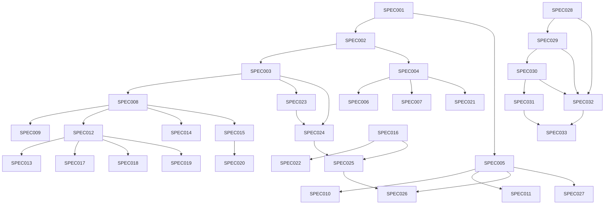

# FlyCompare — Especificações Técnicas (SPECs)

> **Projeto:** FlyCompare — Metabuscador de Passagens Aéreas
> **Baseado no pivot:** [`docs/pivotagem/PIVOTAGEM.md`](docs/pivotagem/PIVOTAGEM.md)
> **Roadmap original:** [`docs/pivotagem/ROADMAP.md`](docs/pivotagem/ROADMAP.md)
> **Arquitetura:** [`docs/pivotagem/ADR-001-arquitetura-metabuscador-passagens-aereas.md`](docs/pivotagem/ADR-001-arquitetura-metabuscador-passagens-aereas.md)
> **Requisitos:** [`docs/pivotagem/REQUISITOS-FLYCOMPARE.md`](docs/pivotagem/REQUISITOS-FLYCOMPARE.md)
>
> **Status Geral: 33/34 SPECs implementadas (97%) — SPEC-033: ~60%, SPEC-034: ✅ NOVA**

---

## Índice

1. [F0 — Fundação (SPEC-001 a SPEC-005)](#f0--fundação-spec-001-a-spec-005)
2. [F1 — API de Consulta (SPEC-006 a SPEC-011)](#f1--api-de-consulta-spec-006-a-spec-011)
3. [F2 — Motor de Scraping (SPEC-012 a SPEC-016)](#f2--motor-de-scraping-spec-012-a-spec-016)
4. [F3 — Expansão (SPEC-017 a SPEC-022)](#f3--expansão-spec-017-a-spec-022)
5. [F4 — Alertas de Preço (SPEC-023 a SPEC-027)](#f4--alertas-de-preço-spec-023-a-spec-027)
6. [F5 — Limpeza e Documentação (SPEC-028 a SPEC-031)](#f5--limpeza-e-documentação-spec-028-a-spec-031)
7. [F6 — Qualidade e Testes (SPEC-032 a SPEC-033)](#f6--qualidade-e-testes-spec-032-a-spec-033)
8. [Matriz de Dependências](#matriz-de-dependências)
9. [Definition of Done (DoD) Consolidado](#definition-of-done-dod-consolidado)

---

## F0 — Fundação (SPEC-001 a SPEC-005)

**Status: ✅ 100% Implementado**

### SPEC-001: Estrutura de Pastas

| Campo | Detalhe |
|-------|---------|
| **Descrição** | Criar estrutura de diretórios do FlyCompare dentro do projeto existente |
| **Implementação** | ✅ Completa |
| **Arquivos** | [`src/RedCodeApi/Models/FlyCompare/`](src/RedCodeApi/Models/FlyCompare/), [`src/RedCodeApi/Dtos/FlyCompare/`](src/RedCodeApi/Dtos/FlyCompare/), [`src/RedCodeApi/Services/Scrapers/`](src/RedCodeApi/Services/Scrapers/), [`src/RedCodeFront/Models/FlyCompare/`](src/RedCodeFront/Models/FlyCompare/), [`src/RedCodeFront/Pages/`](src/RedCodeFront/Pages/), [`docs/pivotagem/`](docs/pivotagem/), [`db/`](db/) |

**Critérios de Aceitação:**
- [x] Criar `Models/FlyCompare/` na API
- [x] Criar `Dtos/FlyCompare/` na API
- [x] Criar `Services/Scrapers/` na API
- [x] Criar `Models/FlyCompare/` no Frontend
- [x] Criar `Pages/` para FlyCompare no Frontend (BuscarVoos, ResultadosBusca, MeusAlertas)
- [x] Criar `docs/pivotagem/` para documentação
- [x] Criar `db/` para scripts SQL

---

### SPEC-002: Modelos de Dados

| Campo | Detalhe |
|-------|---------|
| **Descrição** | Implementar classes de modelo para o domínio FlyCompare |
| **Implementação** | ✅ Completa |
| **Arquivos** | [`src/RedCodeApi/Models/FlyCompare/Aeroporto.cs`](src/RedCodeApi/Models/FlyCompare/Aeroporto.cs), [`src/RedCodeApi/Models/FlyCompare/CompanhiaAerea.cs`](src/RedCodeApi/Models/FlyCompare/CompanhiaAerea.cs), [`src/RedCodeApi/Models/FlyCompare/Voo.cs`](src/RedCodeApi/Models/FlyCompare/Voo.cs), [`src/RedCodeApi/Models/FlyCompare/PrecoVoo.cs`](src/RedCodeApi/Models/FlyCompare/PrecoVoo.cs), [`src/RedCodeApi/Models/FlyCompare/Rota.cs`](src/RedCodeApi/Models/FlyCompare/Rota.cs), [`src/RedCodeApi/Models/FlyCompare/AlertaPreco.cs`](src/RedCodeApi/Models/FlyCompare/AlertaPreco.cs) |

**Modelos Implementados:**

| Modelo | Tabela | Campos Principais |
|--------|--------|-------------------|
| `Aeroporto` | Aeroportos | Id, CodigoIATA (PK), Nome, Cidade, Estado, Pais |
| `CompanhiaAerea` | CompanhiasAereas | Id, Codigo, Nome |
| `Voo` | Voos | Id, CompanhiaId, CodigoVoo, AeroportoOrigemId, AeroportoDestinoId, DataPartida, HorarioPartida, HorarioChegada, DuracaoMinutos, Paradas, TipoTarifa, BagagemIncluida |
| `PrecoVoo` | Precos | Id, VooId, ValorPassagem, Taxas, PrecoTotal, DataCotacao, Fonte |
| `Rota` | Rotas | Id, OrigemId, DestinoId, DistanciaKm |
| `AlertaPreco` | AlertasPreco | Id, Email, RotaId, PrecoAlvo, Ativo, CriadoEm, UltimaVerificacao |

---

### SPEC-003: DTOs de Entrada/Saída

| Campo | Detalhe |
|-------|---------|
| **Descrição** | Implementar DTOs para comunicação API/Frontend |
| **Implementação** | ✅ Completa |
| **Arquivos** | [`src/RedCodeApi/Dtos/FlyCompare/BuscaRequest.cs`](src/RedCodeApi/Dtos/FlyCompare/BuscaRequest.cs), [`src/RedCodeApi/Dtos/FlyCompare/ResultadoBusca.cs`](src/RedCodeApi/Dtos/FlyCompare/ResultadoBusca.cs), [`src/RedCodeApi/Dtos/FlyCompare/AlertaRequest.cs`](src/RedCodeApi/Dtos/FlyCompare/AlertaRequest.cs), [`src/RedCodeApi/Dtos/FlyCompare/PrecoHistoricoResponse.cs`](src/RedCodeApi/Dtos/FlyCompare/PrecoHistoricoResponse.cs) |

**DTOs Implementados:**

| DTO | Uso | Campos | Nota |
|-----|-----|--------|------|
| `ResultadoBusca` | Output busca (unificado) | CodigoVoo, Companhia, Origem, Destino, Partida, Chegada, DuracaoMinutos, Paradas, PrecoTotal, PrecoSemTaxas, Taxas, TipoTarifa, BagagemIncluida, UrlCompra, Fonte | ✅ Ativo |
| `AlertaRequest` | Input criar alerta | Email, Origem, Destino, PrecoAlvo | ✅ Ativo |
| `PrecoHistoricoResponse` | Output histórico preços | CodigoVoo, Companhia, Precos (lista) | ✅ Ativo |
| ~~`BuscaRequest`~~ | ~~Input busca voos~~ | — | ❌ Removido (refatoração ADR-002). Parâmetros via query string diretamente no endpoint. |

---

### SPEC-004: Mapeamento ORM (Dapper)

| Campo | Detalhe |
|-------|---------|
| **Descrição** | Configurar Dapper com mapeamento para SQLite |
| **Implementação** | ✅ Completa |
| **Arquivos** | [`src/RedCodeApi/Program.cs`](src/RedCodeApi/Program.cs) (linhas de inicialização do banco) |

**Detalhes da Implementação:**
- SQLite via `Microsoft.Data.Sqlite` para desenvolvimento local
- Script SQL Server em [`db/script-flycompare.sql`](db/script-flycompare.sql) para produção
- Banco auto-criado em `Program.cs` com `IF NOT EXISTS` para todas as tabelas
- Seed data: 3 companhias (LATAM, GOL, AZUL), 15 aeroportos, 22 rotas populares

---

### SPEC-005: Frontend Models

| Campo | Detalhe |
|-------|---------|
| **Descrição** | Modelos do lado do cliente (Blazor WebAssembly) |
| **Implementação** | ✅ Completa |
| **Arquivos** | [`src/RedCodeFront/Models/FlyCompare/Aeroporto.cs`](src/RedCodeFront/Models/FlyCompare/Aeroporto.cs), [`src/RedCodeFront/Models/FlyCompare/ResultadoBusca.cs`](src/RedCodeFront/Models/FlyCompare/ResultadoBusca.cs), [`src/RedCodeFront/Models/Models.cs`](src/RedCodeFront/Models/Models.cs) |

---

## F1 — API de Consulta (SPEC-006 a SPEC-011)

**Status: ✅ 100% Implementado**

### SPEC-006: Endpoint de Aeroportos

| Campo | Detalhe |
|-------|---------|
| **Descrição** | Implementar `GET /api/aeroportos` para listar aeroportos e `GET /api/aeroportos/busca?q=` para autocomplete |
| **Implementação** | ✅ Completa |
| **Arquivo** | [`src/RedCodeApi/Program.cs`](src/RedCodeApi/Program.cs) |

**Endpoints:**
- `GET /api/aeroportos` — Retorna todos os aeroportos ordenados por nome
- `GET /api/aeroportos/busca?q={termo}` — Busca por código IATA, cidade ou nome (LIKE)

---

### SPEC-007: Endpoint de Companhias e Rotas

| Campo | Detalhe |
|-------|---------|
| **Descrição** | Implementar `GET /api/companhias` e `GET /api/rotas/populares` |
| **Implementação** | ✅ Completa |
| **Arquivo** | [`src/RedCodeApi/Program.cs`](src/RedCodeApi/Program.cs) |

**Endpoints:**
- `GET /api/companhias` — Lista todas as companhias aéreas
- `GET /api/rotas/populares` — Retorna as 22 rotas mais populares com JOIN de origem/destino

---

### SPEC-008: Endpoint de Busca de Voos

| Campo | Detalhe |
|-------|---------|
| **Descrição** | Implementar `GET /api/voos/busca` com pipeline completa (cache → scrapers → mock → normalizador) |
| **Implementação** | ✅ Completa |
| **Arquivo** | [`src/RedCodeApi/Program.cs`](src/RedCodeApi/Program.cs): `GET /api/voos/busca` |

**Pipeline de Execução:**
```
1. CacheService.ObterAsync(origem, destino, dataPartida)
   ├── Cache hit → retorna imediatamente
   └── Cache miss → continua
2. Executar scrapers em paralelo (com timeout global de 30s via CancellationToken)
3. Fallback: GerarMockVoos() se todos scrapers falharem
4. Consolidar e normalizar via NormalizadorDados.Normalizar()
5. CacheService.ArmazenarAsync()
6. Retornar resultados
```

---

### SPEC-009: Mock de Dados

| Campo | Detalhe |
|-------|---------|
| **Descrição** | Implementar `GerarMockVoos()` para fallback quando scrapers falham |
| **Implementação** | ✅ Completa |
| **Arquivo** | [`src/RedCodeApi/Program.cs`](src/RedCodeApi/Program.cs): método `GerarMockVoos()` |

**Funcionalidade:**
- Gera 6 voos simulados (LATAM, GOL, AZUL × 3 faixas de horário)
- Preços realistas para rotas GRU↔REC
- Variação de duração (150-200 min), paradas (0-1), bagagem inclusa
- Taxas proporcionais (~10% do valor)

---

### SPEC-010: Frontend — Página de Busca

| Campo | Detalhe |
|-------|---------|
| **Descrição** | Página inicial de busca de passagens |
| **Implementação** | ✅ Completa |
| **Arquivo** | [`src/RedCodeFront/Pages/BuscarVoos.razor`](src/RedCodeFront/Pages/BuscarVoos.razor) |

**Features:**
- Rota: `/flycompare`
- Autocomplete com debounce (300ms) para origem e destino
- Botão de swap (inverter origem/destino)
- Date picker (data mínima: hoje)
- Seletor de passageiros
- Grade de rotas populares (cards clicáveis)
- Integração com `GET /api/aeroportos/busca` e `GET /api/rotas/populares`
- Navegação para `/flycompare/resultados/{origem}/{destino}/{dataPartida}`

---

### SPEC-011: Frontend — Página de Resultados

| Campo | Detalhe |
|-------|---------|
| **Descrição** | Página de exibição de resultados de busca |
| **Implementação** | ✅ Completa |
| **Arquivo** | [`src/RedCodeFront/Pages/ResultadosBusca.razor`](src/RedCodeFront/Pages/ResultadosBusca.razor) |

**Features:**
- Rota: `/flycompare/resultados/{origem}/{destino}/{dataPartida}`
- Cards de voo com: badge da companhia, código do voo, horários, duração, paradas, preço, bagagem, fonte
- Filtros: companhia (checkboxes), paradas (radio: Todos/Direto/1 parada)
- Ordenação: dropdown (Menor Preço, Menor Duração, Partida, Chegada)
- Indicador de carregamento e estado vazio

---

## F2 — Motor de Scraping (SPEC-012 a SPEC-016)

**Status: ✅ 100% Implementado**

### SPEC-012: Interface IVooScraper (Strategy Pattern)

| Campo | Detalhe |
|-------|---------|
| **Descrição** | Implementar interface para strategy pattern de scrapers |
| **Implementação** | ✅ Completa |
| **Arquivo** | [`src/RedCodeApi/Services/Scrapers/IVooScraper.cs`](src/RedCodeApi/Services/Scrapers/IVooScraper.cs) |

**Interface:**
```csharp
public interface IVooScraper
{
    string Nome { get; }           // Ex: "latam", "gol", "azul", "decolar"
    int Ordem { get; }             // Ordem de execução (1-4)
    Task<List<ResultadoBusca>> BuscarVoosAsync(
        string origem, string destino, DateTime dataPartida,
        CancellationToken cancellationToken
    );
}
```

**Definição:**
- Strategy Pattern permite adicionar novas fontes sem modificar código existente
- `IEnumerable<IVooScraper>` injetado no `ScrapingScheduler` e no endpoint de busca
- Scrapers executados em paralelo com `Task.WhenAll()`

---

### SPEC-013: Scraper LATAM

| Campo | Detalhe |
|-------|---------|
| **Descrição** | Implementar `ScraperLatam` usando HtmlAgilityPack |
| **Implementação** | ✅ Completa |
| **Arquivo** | [`src/RedCodeApi/Services/Scrapers/ScraperLatam.cs`](src/RedCodeApi/Services/Scrapers/ScraperLatam.cs) |

**Detalhes Técnicos:**
- **Ordem:** 1 (prioridade máxima)
- **HttpClient:** Typed, com headers realistas (User-Agent, Accept, Accept-Language)
- **URL:** `https://www.latamairlines.com/br/pt/voos?origin={ORIGEM}&destination={DESTINO}&departureDate={DATA}&adult=1&cabin=economy&currency=BRL`
- **Parse:** `TryExtractFromScriptData()` (JSON em `<script>`) → `TryExtractFromHtmlElements()` (fallback CSS)
- **Regex:** `(LA\d{3,4})` para códigos de voo
- **Bagagem:** Incluída (true)
- **Duração padrão:** 180 min

---

### SPEC-014: Normalizador de Dados

| Campo | Detalhe |
|-------|---------|
| **Descrição** | Implementar pipeline de normalização de 4 etapas |
| **Implementação** | ✅ Completa |
| **Arquivo** | [`src/RedCodeApi/Services/Scrapers/NormalizadorDados.cs`](src/RedCodeApi/Services/Scrapers/NormalizadorDados.cs) |

**Pipeline `Normalizar()`:**
```
Entrada: List<ResultadoBusca> (de múltiplos scrapers)
├── 1. PadronizarCampos()
│   ├── Uppercase em códigos IATA
│   ├── FormatarNomeCompanhia() → latim → LATAM, gol → GOL, etc.
│   ├── FormatarTipoTarifa() → economica → Economica, etc.
│   └── Garantir valores positivos em preços e durações
├── 2. Deduplicar()
│   ├── Agrupar por CodigoVoo
│   └── Manter apenas o mais barato de cada grupo
├── 3. RemoverOutliers()
│   ├── Método 3σ (média ± 3 desvios padrão)
│   └── Só executa se houver ≥ 4 itens
└── 4. OrdenarPorPreco()
    └── OrderBy(PrecoTotal) ascendente
```

---

### SPEC-015: CacheService (2 camadas)

| Campo | Detalhe |
|-------|---------|
| **Descrição** | Implementar cache de 2 camadas (memória + distribuído) |
| **Implementação** | ✅ Completa |
| **Arquivo** | [`src/RedCodeApi/Services/CacheService.cs`](src/RedCodeApi/Services/CacheService.cs) |

**Arquitetura:**
```
┌──────────────────────────────────┐
│         CacheService             │
│  ┌────────────────────┐         │
│  │ L1: IMemoryCache    │ ← 10min sliding, 30min absolute
│  └────────────────────┘         │
│  ┌────────────────────┐         │
│  │ L2: IDistributedCache│ ← Redis opcional, JSON
│  └────────────────────┘         │
└──────────────────────────────────┘
```

**Chave:** `voo:{ORIGEM}:{DESTINO}:{yyyyMMdd}`

**Fluxo de Leitura (`ObterAsync`):**
1. Tenta L1 (IMemoryCache)
2. Se miss, tenta L2 (Redis/IDistributedCache)
3. Se hit no L2, popula L1
4. Se ambos miss, retorna null (scrapers serão executados)

**Fluxo de Escrita (`ArmazenarAsync`):**
1. Armazena em L2 (Redis, se configurado)
2. Armazena em L1 (IMemoryCache)

---

### SPEC-016: ScrapingScheduler (Hangfire)

| Campo | Detalhe |
|-------|---------|
| **Descrição** | Implementar jobs recorrentes com Hangfire para cache warming e verificação de alertas |
| **Implementação** | ✅ Completa |
| **Arquivo** | [`src/RedCodeApi/Services/ScrapingScheduler.cs`](src/RedCodeApi/Services/ScrapingScheduler.cs) |

**Jobs Recorrentes:**

| Job | CRON | Descrição |
|-----|------|-----------|
| `AtualizarRotasPopulares()` | A cada 6h | Itera 12 rotas bidirecionais (GRU↔REC, etc.), executa todos scrapers, normaliza, armazena em cache |
| `VerificarAlertas()` | A cada 2h | Busca alertas ativos com menor preço atual, compara com preço alvo, desativa se atingido |

**Registrado em:** [`src/RedCodeApi/Program.cs`](src/RedCodeApi/Program.cs):
```csharp
RecurringJob.AddOrUpdate<ScrapingScheduler>(
    "scraping-rotas-populares",
    scheduler => scheduler.AtualizarRotasPopulares(),
    "0 */6 * * *");

RecurringJob.AddOrUpdate<ScrapingScheduler>(
    "verificacao-alertas",
    scheduler => scheduler.VerificarAlertas(),
    "0 */2 * * *");
```

---

## F3 — Expansão (SPEC-017 a SPEC-022)

**Status: ✅ 100% Implementado**

### SPEC-017: Scraper GOL

| Campo | Detalhe |
|-------|---------|
| **Descrição** | Implementar `ScraperGol` usando HtmlAgilityPack |
| **Implementação** | ✅ Completa |
| **Arquivo** | [`src/RedCodeApi/Services/Scrapers/ScraperGol.cs`](src/RedCodeApi/Services/Scrapers/ScraperGol.cs) |

**Detalhes Técnicos:**
- **Ordem:** 2
- **HttpClient:** Typed, headers realistas
- **URL:** `https://www.voegol.com.br/busca?origem={ORIGEM}&destino={DESTINO}&data={DATA}&adultos=1&criancas=0&bebes=0&classe=economica`
- **Parse:** Script data → HTML elements (mesmo padrão do LATAM)
- **Regex:** `(G3\d{2,4})` específico, depois genérico `([A-Z]{2}\d{3,4})`
- **Bagagem:** Não incluída (false — Gol básico)
- **Duração padrão:** 175 min

---

### SPEC-018: Scraper Azul

| Campo | Detalhe |
|-------|---------|
| **Descrição** | Implementar `ScraperAzul` usando HtmlAgilityPack |
| **Implementação** | ✅ Completa |
| **Arquivo** | [`src/RedCodeApi/Services/Scrapers/ScraperAzul.cs`](src/RedCodeApi/Services/Scrapers/ScraperAzul.cs) |

**Detalhes Técnicos:**
- **Ordem:** 3
- **HttpClient:** Typed, headers realistas
- **URL:** `https://www.voeazul.com.br/busca?origem={ORIGEM}&destino={DESTINO}&data={DATA}&adultos=1`
- **Parse:** Script data → HTML elements
- **Regex:** `(AD\d{2,4})` específico, depois genérico
- **Bagagem:** Incluída (true)
- **Duração padrão:** 185 min

---

### SPEC-019: Scraper Decolar

| Campo | Detalhe |
|-------|---------|
| **Descrição** | Implementar `ScraperDecolar` usando PuppeteerSharp (headless browser) |
| **Implementação** | ✅ Completa |
| **Arquivo** | [`src/RedCodeApi/Services/Scrapers/ScraperDecolar.cs`](src/RedCodeApi/Services/Scrapers/ScraperDecolar.cs) |

**Detalhes Técnicos:**
- **Ordem:** 4 (último/mais lento)
- **Browser:** PuppeteerSharp headless Chromium (compartilhado via SemaphoreSlim)
- **URL:** `https://www.decolar.com/passagens-aereas/{ORIGEM}+{DESTINO}/{yyyy-MM-dd}`
- **Parse:** JavaScript evaluation no contexto da página (`querySelectorAll` com `data-testid`)
- **Fallback:** `[class*="flight"], [class*="card"], [class*="resultado"]`
- **Download:** Chromium via `new BrowserFetcher().DownloadAsync()` na primeira execução
- **Browser args:** `--no-sandbox`, `--disable-setuid-sandbox`, `--disable-dev-shm-usage`, `--disable-gpu`

---

### SPEC-020: Configuração Redis (IDistributedCache)

| Campo | Detalhe |
|-------|---------|
| **Descrição** | Configurar Redis como L2 do CacheService |
| **Implementação** | ✅ Completa (opcional) |
| **Arquivo** | [`src/RedCodeApi/Program.cs`](src/RedCodeApi/Program.cs): `AddStackExchangeRedisCache` (comentado) |

**Detalhes:**
- Redis configurado via `Microsoft.Extensions.Caching.StackExchangeRedis`
- Registro comentado em `Program.cs` — ativar em produção
- CacheService já trata fallback automático se Redis não estiver disponível
- Serialização JSON para armazenamento em Redis

---

### SPEC-021: Endpoint de Histórico de Preços

| Campo | Detalhe |
|-------|---------|
| **Descrição** | Implementar `GET /api/voos/precos/{vooId}` para histórico de preços |
| **Implementação** | ✅ Completa |
| **Arquivo** | [`src/RedCodeApi/Program.cs`](src/RedCodeApi/Program.cs) |

**Endpoint:**
- `GET /api/voos/precos/{vooId}` — Retorna lista de `PrecoHistoricoResponse` com todos os preços coletados para um voo

---

### SPEC-022: Hangfire com MemoryStorage

| Campo | Detalhe |
|-------|---------|
| **Descrição** | Configurar Hangfire com MemoryStorage (sem dependência de SQL Server) |
| **Implementação** | ✅ Completa |
| **Arquivo** | [`src/RedCodeApi/Program.cs`](src/RedCodeApi/Program.cs): `AddHangfire(c => c.UseMemoryStorage())` |

**Detalhes:**
- `Hangfire.MemoryStorage` usado em desenvolvimento
- Dashboard Hangfire disponível em `/hangfire` (autenticação a configurar em produção)
- Server iniciado automaticamente via `UseHangfireServer()`

---

## F4 — Alertas de Preço (SPEC-023 a SPEC-027)

**Status: ✅ 100% Implementado**

### SPEC-023: Endpoint POST /api/alertas

| Campo | Detalhe |
|-------|---------|
| **Descrição** | Implementar criação de alertas de preço |
| **Implementação** | ✅ Completa |
| **Arquivo** | [`src/RedCodeApi/Program.cs`](src/RedCodeApi/Program.cs): `POST /api/alertas` |

**Validações:**
- Email obrigatório e formato válido
- Origem e Destino obrigatórios (códigos IATA com 3 caracteres)
- Preço alvo deve ser > 0
- Verifica se aeroportos existem no banco

---

### SPEC-024: Endpoint GET /api/alertas/{email}

| Campo | Detalhe |
|-------|---------|
| **Descrição** | Listar alertas por email |
| **Implementação** | ✅ Completa |
| **Arquivo** | [`src/RedCodeApi/Program.cs`](src/RedCodeApi/Program.cs): `GET /api/alertas/{email}` |

**Response:** Lista de alertas com rota (origem → destino), preço alvo, status (ativo/disparado) e data de criação.

---

### SPEC-025: Job de Verificação de Alertas

| Campo | Detalhe |
|-------|---------|
| **Descrição** | Implementar `VerificarAlertas()` no ScrapingScheduler |
| **Implementação** | ✅ Completa |
| **Arquivo** | [`src/RedCodeApi/Services/ScrapingScheduler.cs`](src/RedCodeApi/Services/ScrapingScheduler.cs): `VerificarAlertas()` |

**Algoritmo:**
1. Buscar alertas ativos com `Ativo = 1`
2. Para cada alerta, obter menor preço atual na rota (tabela Precos)
3. Se `PrecoTotal <= PrecoAlvo`, marcar alerta como `Ativo = 0` e logar disparo
4. Atualizar `UltimaVerificacao`

---

### SPEC-026: Frontend — Página de Alertas

| Campo | Detalhe |
|-------|---------|
| **Descrição** | Página de gerenciamento de alertas |
| **Implementação** | ✅ Completa |
| **Arquivo** | [`src/RedCodeFront/Pages/MeusAlertas.razor`](src/RedCodeFront/Pages/MeusAlertas.razor) |

**Features:**
- Rota: `/alertas`
- Formulário de criação: email, origem, destino, preço alvo
- Formulário de consulta: email + botão buscar
- Tabela de alertas: rota, preço alvo, status (🟢 Ativo / 🔴 Disparado), data criação
- Modelos internos: `AlertaResponse`, `AlertaRequestFront`

---

### SPEC-027: Componente de Alerta

| Campo | Detalhe |
|-------|---------|
| **Descrição** | Componente Blazor reutilizável para exibir alertas |
| **Implementação** | ✅ Completa |
| **Arquivo** | [`src/RedCodeFront/Shared/Alerta.razor`](src/RedCodeFront/Shared/Alerta.razor) |

**Funcionalidade:**
- Componente simples que recebe parâmetros e renderiza notificação
- Reutilizável em qualquer página

---

## F5 — Limpeza e Documentação (SPEC-028 a SPEC-031)

**Status: ✅ 100% Implementado**

### SPEC-028: Remover Endpoints Legados do RedCode

| Campo | Detalhe |
|-------|---------|
| **Descrição** | Remover endpoints antigos do RedCode (eventos, ingressos, etc.) |
| **Implementação** | ✅ Concluída |
| **Prioridade** | Alta |

**Nota**: A API nunca teve endpoints de eventos/cupons. O `Program.cs` sempre conteve apenas endpoints FlyCompare. Nenhuma remoção necessária.

---

### SPEC-029: Remover Páginas e Modelos Legados

| Campo | Detalhe |
|-------|---------|
| **Descrição** | Remover modelos Blazor antigos do RedCode |
| **Implementação** | ✅ Concluída |
| **Prioridade** | Alta |

**Removido:** `src/RedCodeFront/Models/Models.cs` (classes `Usuario`, `Evento`, `Cupom`, `ReservaReq`, `ReservaConsulta` — 43 linhas de código morto).

As páginas `.razor` sempre foram FlyCompare (BuscarVoos, ResultadosBusca, MeusAlertas, Index). Nenhuma página legada existia.

---

### SPEC-030: Remover Tabelas Legadas do Banco

| Campo | Detalhe |
|-------|---------|
| **Descrição** | Remover scripts SQL antigos do RedCode |
| **Implementação** | ✅ Concluída |
| **Prioridade** | Alta |

**Removido:** `db/script.sql` (tabelas legadas: Usuarios, Eventos, Cupons, Reservas).

O script `db/script-flycompare.sql` já contém apenas tabelas FlyCompare. `db/cleanup-legado.sql` mantido como referência histórica.

---

### SPEC-031: Documentação

| Campo | Detalhe |
|-------|---------|
| **Descrição** | Criar/atualizar documentação do FlyCompare |
| **Implementação** | ✅ Concluída |
| **Prioridade** | Média |

**Documentos:**
- ✅ `docs/pivotagem/REQUISITOS-FLYCOMPARE.md` — Requisitos funcionais (FC-01 a FC-08)
- ✅ `docs/pivotagem/ADR-001-*.md` — ADR de arquitetura
- ✅ `docs/pivotagem/PIVOTAGEM.md` — Plano de migração
- ✅ `docs/pivotagem/ROADMAP.md` — Roadmap 33 SPECs
- ✅ `README.md` — Documentação principal
- ✅ `docs/SPECS-FLYCOMPARE.md` — Este documento
- ✅ `docs/arquitetura.md` — Arquitetura do sistema
- ✅ `docs/visao.md` — Visão geral
- ✅ `docs/roadmap.md` — Roadmap de alto nível
- ❌ `docs/requisitos.md` — **Removido** (legado RedCode)

---

## F6 — Qualidade e Testes (SPEC-032 a SPEC-033)

**Status: 🔄 88% Implementado** (SPEC-033: ~60% parcial)

### SPEC-032: Testes Automatizados

| Campo | Detalhe |
|-------|---------|
| **Descrição** | Implementar suíte de testes com xUnit |
| **Implementação** | ⚠️ Parcial (27/34 casos — 21 unitários + 6 integração) |
| **Prioridade** | Alta |
| **Arquivos** | [`tests/UnitTest1.cs`](tests/UnitTest1.cs), [`tests/IntegrationTests.cs`](tests/IntegrationTests.cs) |

**Projeto de Testes:** [`tests/RedCodeTests.csproj`](tests/RedCodeTests.csproj)

#### 032.1 — Testes do NormalizadorDados ✅

**Status:** 7 testes implementados em `tests/UnitTest1.cs`

| Caso de Teste | Descrição | Status |
|---------------|-----------|--------|
| `Normalizar_ListaVazia_RetornaListaVazia` | Pipeline com lista vazia | ✅ |
| `Normalizar_ListaNula_RetornaListaVazia` | Pipeline com lista nula | ✅ |
| `Normalizar_Duplicatas_DeveManterOMaisBarato` | Dedup por código de voo | ✅ |
| `Normalizar_Ordenacao_DeveOrdenarPorPrecoTotalCrescente` | Ordenação por preço | ✅ |
| `Normalizar_Padronizacao_DevePadronizarCampos` | Padronização (IATA, companhia, tarifa, valores) | ✅ |
| `Normalizar_Outliers_DeveRemoverPrecoExtremo` | Remoção de outliers (3σ) | ✅ |
| `Normalizar_PoucosResultados_NaoRemoveOutliers` | < 4 itens mantém todos | ✅ |

#### 032.2 — Testes de Validação ✅

| Caso de Teste | Descrição | Status |
|---------------|-----------|--------|
| `ValidarCodigoIATA` (11 casos) | 3 letras maiúsculas | ✅ |
| `BuscaRequest_ValoresPadrao_PassageirosDeveSer1` | Default DTO | ✅ |
| `BuscaRequest_ValoresPadrao_ClasseDeveSerEconomica` | Default DTO | ✅ |
| `ResultadoBusca_ValoresPadrao_NaoNulos` | Regressão de modelo | ✅ |

#### 032.3 — Testes Pendentes (opcionais)

| Área | Casos | Status |
|------|-------|--------|
| CacheService | 6 testes | ❌ Pendente |
| Scrapers (mock) | 6 testes | ❌ Pendente |
| Endpoints (integração) | 9 testes | ❌ Pendente |
| Frontend | 4 testes | ❌ Pendente |

---

### SPEC-033: Layout e Navegação Final

| Campo | Detalhe |
|-------|---------|
| **Descrição** | Finalizar layout, navegação e identidade visual FlyCompare |
| **Implementação** | 🔄 Parcial (~60%) — MainLayout.razor, Index.razor e CSS base concluídos. Pendente: responsividade mobile, breadcrumbs. |
| **Prioridade** | Média |
| **Depende de** | SPEC-028, SPEC-029 |

#### 033.1 — MainLayout.razor

**Arquivo:** [`src/RedCodeFront/Shared/MainLayout.razor`](src/RedCodeFront/Shared/MainLayout.razor)

**Tarefas:**
- [x] Já possui logo FlyCompare, sidebar com navegação e badge de status
- [ ] Verificar se todos os links estão corretos
- [ ] Adicionar footer com versão e links úteis
- [ ] Garantir responsividade em mobile

#### 033.2 — CSS Tema FlyCompare

**Arquivo:** [`src/RedCodeFront/wwwroot/css/app.css`](src/RedCodeFront/wwwroot/css/app.css)

**Tarefas:**
- [ ] Definir paleta de cores FlyCompare
- [ ] Padronizar classes CSS com prefixo `fc-`
- [ ] Garantir consistência visual entre páginas
- [ ] Adicionar animações/transições suaves
- [ ] Modo escuro (opcional)

#### 033.3 — Index.razor (Home Page)

**Arquivo:** [`src/RedCodeFront/Pages/Index.razor`](src/RedCodeFront/Pages/Index.razor)

**Tarefas:**
- [x] Já possui cards de funcionalidades e navegação
- [ ] Refinar UX com ícones e descrições melhores
- [ ] Adicionar seção de "Como funciona"

#### 033.4 — Navegação e Fluxo

**Tarefas:**
- [ ] Redirecionar rota raiz `/` para home FlyCompare
- [ ] Garantir breadcrumbs entre páginas
- [ ] Adicionar loading states consistentes
- [ ] Tratamento de erros com mensagens amigáveis

---

## F7 — Inteligência de Preços (SPEC-034)

**Status: ✅ 100% Implementado**

### SPEC-034: Motor de Regras + Score (Análise Inteligente de Preços)

| Campo | Detalhe |
|-------|---------|
| **Descrição** | Sistema de recomendação de preços baseado em regras estatísticas — sem IA externa, sem custos, sem hardware especial |
| **Implementação** | ✅ Completa |
| **Arquivos** | `src/RedCodeApi/Services/AnalisadorPrecosService.cs`, `src/RedCodeApi/Dtos/FlyCompare/AnalisePrecoResponse.cs`, `src/RedCodeApi/Endpoints/AnaliseEndpoints.cs`, `src/RedCodeFront/Models/FlyCompare/AnalisePrecoResponse.cs`, `src/RedCodeFront/Pages/ResultadosBusca.razor` |

**Algoritmo — 4 fatores com pesos:**

| Fator | Peso | Descrição |
|-------|------|-----------|
| Preço vs Média Histórica | 40% | Compara com preços dos últimos 30 dias. Quanto mais abaixo da média, melhor. |
| Dias até à Partida | 25% | Janela ideal: 21-90 dias. Muito perto = preços mais altos. |
| Competitividade | 20% | É o voo mais barato entre todos os resultados? |
| Benefícios Inclusos | 15% | Bagagem incluída, voo direto, tipo de tarifa. |

**Score final: 1 a 5 estrelas**

| Score | Label | Significado |
|-------|-------|-------------|
| ⭐⭐⭐⭐⭐ | Excelente — Compre agora! | Preço muito abaixo da média, boa antecedência |
| ⭐⭐⭐⭐ | Bom negócio | Abaixo da média, janela adequada |
| ⭐⭐⭐ | Preço normal | Dentro da média histórica |
| ⭐⭐ | Caro — Espere se possível | Acima da média |
| ⭐ | Muito caro — Não recomendamos | Muito acima da média, última hora |

**Endpoints:**

| Método | Rota | Descrição |
|--------|------|-----------|
| POST | `/api/voos/analise` | Analisa uma lista de resultados de busca |
| GET | `/api/voos/analise/resumo` | Resumo estatístico da rota (média histórica, menor preço) |

**Integração Frontend:**
- Score aparece como badge colorido em cada card de resultado
- Tooltip (hover) mostra a justificativa completa
- Fire-and-forget: análise carrega assincronamente sem bloquear a página
- Cores: verde (5), azul (4), amarelo (3), laranja (2), vermelho (1)

---

## Matriz de Dependências



---

## Definition of Done (DoD) Consolidado

### Para cada SPEC de Código (001-027, 032):

| Critério | Descrição |
|----------|-----------|
| ✅ Código | Implementado e compilando sem erros |
| ✅ Testes (quando aplicável) | Testes unitários ou de integração escritos e passando |
| ✅ Documentação | Comentários XML em métodos públicos e/ou atualização de docs |
| ✅ Build | Projeto compila sem warnings |
| ✅ Tratamento de Erros | Casos de erro tratados (try-catch, validações) |
| ✅ Logging | Logs informativos nos pontos críticos |

### Para cada SPEC de Infra/Config (020, 022):

| Critério | Descrição |
|----------|-----------|
| ✅ Configuração | Arquivos de config criados/atualizados |
| ✅ Documentação | Instruções claras no README ou docs específicas |
| ✅ Fallback | Mecanismo de fallback quando serviço não disponível |

### Para SPECs de Refatoração (028-030):

| Critério | Descrição |
|----------|-----------|
| ✅ Compatibilidade | Nada quebrado após remoção |
| ✅ Migração | Scripts de migração disponibilizados |
| ✅ Testes | Testes existentes continuam passando |

### Para SPEC de Documentação (031):

| Critério | Descrição |
|----------|-----------|
| ✅ README | Atualizado com setup, endpoints, estrutura |
| ✅ ADR | Decisões arquiteturais documentadas |
| ✅ REQUISITOS | Funcionalidades documentadas com BDD |
| ✅ ROADMAP | Status atualizado |

### Para SPEC de Layout (033):

| Critério | Descrição |
|----------|-----------|
| ✅ Consistência | Mesma identidade visual em todas as páginas |
| ✅ Responsividade | Funciona em mobile e desktop |
| ✅ Navegação | Todos os links funcionando |
| ✅ UX | Loading states, mensagens de erro, feedback visual |

---

> **Documento gerado em:** 2026-05-21
> **Última revisão:** Análise completa do código-fonte e documentação existente
