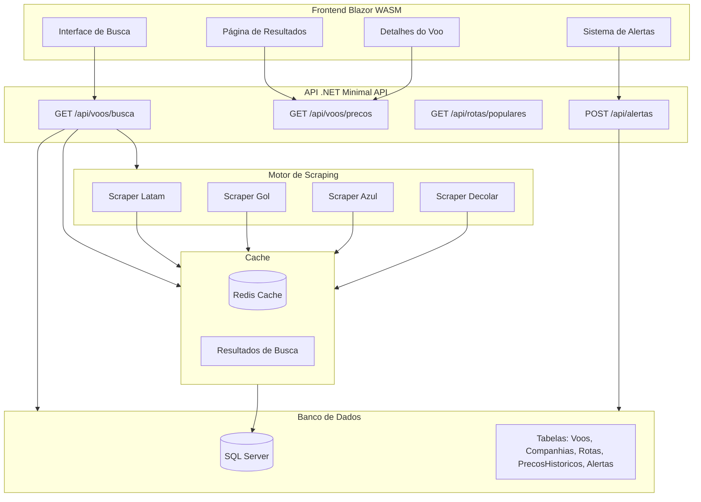
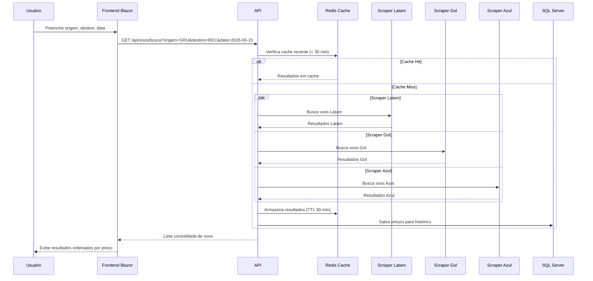
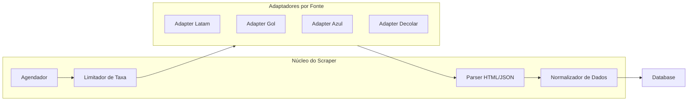

# ✈️ Plano de Pivotagem — RedCode → FlyCompare

## Metadados do Documento

| Campo | Valor |
|---|---|
| **Versão** | 1.0 |
| **Data** | 2026-05-14 |
| **Autor** | Plano gerado para equipe Red-code |
| **Propósito** | Documento de pivotagem do sistema RedCode (bilheteria de eventos) para FlyCompare (metabuscador de passagens aéreas) |
| **Público-alvo** | Qualquer IA ou desenvolvedor que precise entender, modificar ou dar continuidade ao projeto |

---

## 1. Resumo Executivo

O **FlyCompare** é um metabuscador de passagens aéreas que pesquisa preços e rotas em múltiplas fontes online (sites de companhias aéreas, OTAs como Decolar, Kayak, etc.) e apresenta os resultados consolidados para o usuário, permitindo comparação de preços, horários e escalas.

A pivotagem aproveita a estrutura existente do RedCode (.NET, Blazor, SQL Server, Dapper, xUnit) mas **substitui completamente** o domínio de negócio, a lógica de scraping/integração e os endpoints.

---

## 2. Comparação: Estado Atual vs. Estado Futuro

| Aspecto | RedCode (Atual) | FlyCompare (Futuro) |
|---|---|---|
| **Domínio** | Bilheteria de eventos | Metabusca de passagens aéreas |
| **Fonte de dados** | Banco local (insert manual) | Web scraping + APIs externas |
| **Modelo principal** | Evento, Reserva, Cupom | Voo, Trecho, Preco, CompanhiaAerea |
| **Endpoints** | CRUD de eventos/usuários/reservas | Busca de voos, histórico de preços, alertas |
| **Autenticação** | Nenhuma | JWT / Identity (futuro) |
| **Banco** | SQL Server (Docker) | SQL Server + Cache Redis (futuro) |
| **Frontend** | Blazor WASM | Blazor WASM (adaptado) |
| **Testes** | xUnit (regras de negócio) | xUnit (scraping, parsing, lógica de busca) |
| **Deploy** | Local com Docker | Local com Docker / Cloud (futuro) |

---

## 3. Arquitetura Alvo

### 3.1 Diagrama de Componentes



### 3.2 Fluxo de Busca (End-to-End)



---

## 4. Modelo de Dados

### 4.1 Tabelas no SQL Server

```sql
-- =============================================
-- NOVAS TABELAS - FlyCompare
-- =============================================

-- Companhias Aéreas
CREATE TABLE CompanhiasAereas (
    Id INT IDENTITY(1,1) PRIMARY KEY,
    Codigo VARCHAR(5) NOT NULL UNIQUE, -- EX: LATAM, GOL, AZUL, 123MI
    Nome VARCHAR(100) NOT NULL,
    SiteBase VARCHAR(500) NOT NULL, -- URL base para scraping
    Ativo BIT NOT NULL DEFAULT 1,
    DataCadastro DATETIME DEFAULT GETDATE()
);

-- Aeroportos
CREATE TABLE Aeroportos (
    Id INT IDENTITY(1,1) PRIMARY KEY,
    CodigoIATA VARCHAR(3) NOT NULL UNIQUE, -- EX: GRU, REC, CGH, SDU
    Nome VARCHAR(200) NOT NULL,
    Cidade VARCHAR(100) NOT NULL,
    Estado VARCHAR(5), -- SP, RJ, PE...
    Pais VARCHAR(50) NOT NULL DEFAULT 'Brasil',
    Latitude DECIMAL(10,7),
    Longitude DECIMAL(10,7)
);

-- Rotas
CREATE TABLE Rotas (
    Id INT IDENTITY(1,1) PRIMARY KEY,
    OrigemId INT NOT NULL,
    DestinoId INT NOT NULL,
    CONSTRAINT FK_Rotas_Origem FOREIGN KEY (OrigemId) REFERENCES Aeroportos(Id),
    CONSTRAINT FK_Rotas_Destino FOREIGN KEY (DestinoId) REFERENCES Aeroportos(Id),
    CONSTRAINT UQ_Rotas UNIQUE (OrigemId, DestinoId)
);

-- Voos (resultado de scraping)
CREATE TABLE Voos (
    Id INT IDENTITY(1,1) PRIMARY KEY,
    RotaId INT NOT NULL,
    CompanhiaId INT NOT NULL,
    CodigoVoo VARCHAR(20) NOT NULL, -- EX: LA3354, G31234
    DataPartida DATETIME NOT NULL,
    DataChegada DATETIME NOT NULL,
    DuracaoMinutos INT NOT NULL,
    Paradas INT NOT NULL DEFAULT 0,
    AeroportoEscalaId INT NULL, -- NULL se direto
    Classe VARCHAR(50) DEFAULT 'Econômica',
    CONSTRAINT FK_Voos_Rota FOREIGN KEY (RotaId) REFERENCES Rotas(Id),
    CONSTRAINT FK_Voos_Companhia FOREIGN KEY (CompanhiaId) REFERENCES CompanhiasAereas(Id),
    CONSTRAINT FK_Voos_Escala FOREIGN KEY (AeroportoEscalaId) REFERENCES Aeroportos(Id)
);

-- Preços (histórico de preços para cada voo)
CREATE TABLE Precos (
    Id INT IDENTITY(1,1) PRIMARY KEY,
    VooId INT NOT NULL,
    Preco DECIMAL(18,2) NOT NULL,
    Taxas DECIMAL(18,2) NOT NULL DEFAULT 0,
    PrecoTotal DECIMAL(18,2) NOT NULL,
    Moeda VARCHAR(3) NOT NULL DEFAULT 'BRL',
    TipoTarifa VARCHAR(50) NOT NULL DEFAULT 'Econômica', -- Promo, Plus, Flex
    BagagemIncluida BIT NOT NULL DEFAULT 0,
    FranquiaBagagemKg INT NULL,
    UrlDestino VARCHAR(1000) NOT NULL, -- URL para comprar no site original
    Fonte VARCHAR(100) NOT NULL, -- EX: scraping-latam, scraping-decolar
    DataColeta DATETIME NOT NULL DEFAULT GETDATE(),
    CONSTRAINT FK_Precos_Voo FOREIGN KEY (VooId) REFERENCES Voos(Id)
);

-- Alertas de Preço
CREATE TABLE AlertasPreco (
    Id INT IDENTITY(1,1) PRIMARY KEY,
    Email VARCHAR(200) NOT NULL,
    RotaId INT NOT NULL,
    PrecoAlvo DECIMAL(18,2) NOT NULL, -- Alerta dispara quando preco < alvo
    Ativo BIT NOT NULL DEFAULT 1,
    DataCriacao DATETIME DEFAULT GETDATE(),
    CONSTRAINT FK_Alertas_Rota FOREIGN KEY (RotaId) REFERENCES Rotas(Id)
);

-- Cache de Busca (tabela auxiliar para fallback se Redis não disponível)
CREATE TABLE CacheBusca (
    Id INT IDENTITY(1,1) PRIMARY KEY,
    ChaveCache VARCHAR(500) NOT NULL UNIQUE, -- hash da consulta: origem_destino_data_classe
    ResultadoJson NVARCHAR(MAX) NOT NULL, -- resultados serializados
    DataExpiracao DATETIME NOT NULL,
    DataCriacao DATETIME DEFAULT GETDATE()
);
```

### 4.2 Classes C# (Models)

```csharp
// Models para o domínio FlyCompare
public class CompanhiaAerea {
    public int Id { get; set; }
    public string Codigo { get; set; } = string.Empty;
    public string Nome { get; set; } = string.Empty;
    public string SiteBase { get; set; } = string.Empty;
    public bool Ativo { get; set; } = true;
}

public class Aeroporto {
    public int Id { get; set; }
    public string CodigoIATA { get; set; } = string.Empty;
    public string Nome { get; set; } = string.Empty;
    public string Cidade { get; set; } = string.Empty;
    public string? Estado { get; set; }
    public string Pais { get; set; } = "Brasil";
}

public class Voo {
    public int Id { get; set; }
    public int RotaId { get; set; }
    public int CompanhiaId { get; set; }
    public string CodigoVoo { get; set; } = string.Empty;
    public DateTime DataPartida { get; set; }
    public DateTime DataChegada { get; set; }
    public int DuracaoMinutos { get; set; }
    public int Paradas { get; set; }
    public int? AeroportoEscalaId { get; set; }
}

public class PrecoVoo {
    public int Id { get; set; }
    public int VooId { get; set; }
    public decimal Preco { get; set; }
    public decimal Taxas { get; set; }
    public decimal PrecoTotal { get; set; }
    public string Moeda { get; set; } = "BRL";
    public string TipoTarifa { get; set; } = "Econômica";
    public bool BagagemIncluida { get; set; }
    public string UrlDestino { get; set; } = string.Empty;
    public string Fonte { get; set; } = string.Empty;
    public DateTime DataColeta { get; set; }
}

// DTOs para requests/responses
public class BuscaRequest {
    public string Origem { get; set; } = string.Empty; // Código IATA
    public string Destino { get; set; } = string.Empty;
    public DateTime DataPartida { get; set; }
    public DateTime? DataVolta { get; set; }
    public int Passageiros { get; set; } = 1;
    public string Classe { get; set; } = "Econômica";
}

public class ResultadoBusca {
    public string CodigoVoo { get; set; } = string.Empty;
    public string Companhia { get; set; } = string.Empty;
    public string Origem { get; set; } = string.Empty;
    public string Destino { get; set; } = string.Empty;
    public DateTime Partida { get; set; }
    public DateTime Chegada { get; set; }
    public int DuracaoMinutos { get; set; }
    public int Paradas { get; set; }
    public decimal PrecoTotal { get; set; }
    public string TipoTarifa { get; set; } = string.Empty;
    public bool BagagemIncluida { get; set; }
    public string UrlCompra { get; set; } = string.Empty;
    public string Fonte { get; set; } = string.Empty;
}
```

---

## 5. Endpoints da API

### 5.1 Endpoints Principais

| Método | Rota | Descrição | Substitui |
|---|---|---|---|
| `GET` | `/api/voos/busca` | Buscar voos por origem, destino e data | `GET /api/eventos` |
| `GET` | `/api/voos/{id}` | Detalhes de um voo específico | `GET /api/eventos/{id}` |
| `GET` | `/api/voos/precos/{vooId}` | Histórico de preços de um voo | — (novo) |
| `GET` | `/api/aeroportos` | Listar aeroportos (autocomplete) | — (novo) |
| `GET` | `/api/aeroportos/busca?q=` | Buscar aeroportos por nome/cidade | — (novo) |
| `GET` | `/api/companhias` | Listar companhias aéreas | — (novo) |
| `GET` | `/api/rotas/populares` | Rotas mais buscadas | — (novo) |
| `POST` | `/api/alertas` | Criar alerta de preço | `POST /api/reservas` |
| `GET` | `/api/alertas/{email}` | Listar alertas de um email | `GET /api/reservas/{cpf}` |

### 5.2 Endpoints Excluídos (RedCode)

Os seguintes endpoints do RedCode **não fazem sentido** no FlyCompare e devem ser removidos:

- ~~`POST /api/usuarios`~~ → Substituído por sistema de alertas por email (sem cadastro)
- ~~`POST /api/eventos`~~ → Substituído pela busca + scraping
- ~~`POST /api/cupons`~~ → Não aplicável
- ~~`GET /api/cupons/{codigo}`~~ → Não aplicável

---

## 6. Motor de Scraping

### 6.1 Arquitetura do Scraper



### 6.2 Estratégias de Scraping

Cada companhia/fonte exigirá uma estratégia diferente:

| Fonte | Estratégia | Ferramenta | Complexidade |
|---|---|---|---|
| **Latam** | API não-oficial / scraping de página de busca | `HttpClient` + HTML Agility Pack | Alta |
| **Gol** | API não-oficial / scraping | `HttpClient` + HTML Agility Pack | Alta |
| **Azul** | API não-oficial / scraping | `HttpClient` + HTML Agility Pack | Alta |
| **Decolar** | Scraping de resultados de busca | Playwright.NET / PuppeteerSharp | Muito Alta |
| **Kayak** | Scraping com browser headless | Playwright.NET | Muito Alta |

### 6.3 Pacotes NuGet Necessários

```xml
<!-- Scraping -->
<PackageReference Include="HtmlAgilityPack" Version="1.11.*" />
<PackageReference Include="PuppeteerSharp" Version="*" />
<!-- ou -->
<PackageReference Include="Microsoft.Playwright" Version="*" />

<!-- Cache -->
<PackageReference Include="Microsoft.Extensions.Caching.StackExchangeRedis" Version="*" />

<!-- Background Jobs (para scraping assíncrono) -->
<PackageReference Include="Hangfire" Version="*" />
<!-- ou -->
<PackageReference Include="Quartz" Version="*" />
```

### 6.4 Interface do Scraper

```csharp
public interface IVooScraper {
    string Fonte { get; } // EX: "Latam", "Gol"
    Task<List<ResultadoBusca>> BuscarVoosAsync(
        string origem, 
        string destino, 
        DateTime dataPartida,
        CancellationToken cancellationToken
    );
}
```

Cada companhia implementa `IVooScraper` com sua lógica específica de scraping/parsing.

---

## 7. Plano de Migração (Fases)

### Fase 1: Fundação (Setup Inicial)

**Objetivo**: Preparar o projeto para o novo domínio sem quebrar nada.

| # | Tarefa | Arquivos Alterados | Descrição |
|---|---|---|---|
| 1.1 | Criar estrutura de pastas do novo domínio | `src/RedCodeApi/Services/Scrapers/`<br>`src/RedCodeApi/Models/FlyCompare/` | Organizar código por domínio |
| 1.2 | Criar script SQL das novas tabelas | `db/script-flycompare.sql` | Script idempotente com as 7 tabelas |
| 1.3 | Popular tabelas de referência | Seed data no script SQL | Inserir aeroportos (GRU, REC, CGH, SDU, BSB, etc.) e companhias (LATAM, GOL, AZUL, etc.) |
| 1.4 | Criar Models C# do novo domínio | `Models/Aeroporto.cs`, `Models/CompanhiaAerea.cs`, etc. | Conforme seção 4.2 |
| 1.5 | Criar DTOs de Request/Response | `Models/Dtos/BuscaRequest.cs`, `Models/Dtos/ResultadoBusca.cs` | Para a API |

### Fase 2: API de Consulta (Sem Scraping)

**Objetivo**: Implementar endpoints que retornam dados mockados/estáticos primeiro.

| # | Tarefa | Arquivos Alterados | Descrição |
|---|---|---|---|
| 2.1 | Implementar `GET /api/aeroportos` e autocomplete | `Program.cs` | Listar aeroportos do banco |
| 2.2 | Implementar `GET /api/companhias` | `Program.cs` | Listar companhias |
| 2.3 | Implementar `GET /api/rotas/populares` | `Program.cs` | Rotas mais comuns |
| 2.4 | Implementar `GET /api/voos/busca` (mock) | `Program.cs` | Retornar dados mockados inicialmente |
| 2.5 | Adaptar frontend Blazor | `Pages/BuscarVoos.razor` | Nova página de busca com campos: origem, destino, data |

### Fase 3: Motor de Scraping

**Objetivo**: Implementar scraping real de uma companhia (prova de conceito).

| # | Tarefa | Arquivos Alterados | Descrição |
|---|---|---|---|
| 3.1 | Criar interface `IVooScraper` | `Services/Scrapers/IVooScraper.cs` | Contrato do scraper |
| 3.2 | Implementar Scraper Latam (POC) | `Services/Scrapers/ScraperLatam.cs` | Scraping real da Latam |
| 3.3 | Implementar normalizador de dados | `Services/Scrapers/NormalizadorDados.cs` | Padronizar resultados |
| 3.4 | Integrar scraping no endpoint de busca | `Program.cs` | Substituir mock pelo scraper |
| 3.5 | Implementar cache (em memória primeiro) | `Services/CacheService.cs` | Cache simples com `IMemoryCache` |

### Fase 4: Expansão e Robuster

**Objetivo**: Adicionar mais fontes, cache Redis, histórico de preços.

| # | Tarefa | Arquivos Alterados | Descrição |
|---|---|---|---|
| 4.1 | Implementar Scraper Gol | `Services/Scrapers/ScraperGol.cs` | |
| 4.2 | Implementar Scraper Azul | `Services/Scrapers/ScraperAzul.cs` | |
| 4.3 | Implementar Scraper Decolar | `Services/Scrapers/ScraperDecolar.cs` | Scraping com PuppeteerSharp |
| 4.4 | Substituir cache em memória por Redis | `Program.cs`, `Services/CacheService.cs` | Cache distribuído |
| 4.5 | Implementar histórico de preços | `GET /api/voos/precos/{vooId}` | Gráfico de evolução de preços |
| 4.6 | Implementar agendador de scraping | `Services/ScrapingScheduler.cs` | Hangfire/Quartz para atualização periódica |

### Fase 5: Alertas e Experiência do Usuário

**Objetivo**: Sistema de alertas de preço e refinamentos de UX.

| # | Tarefa | Arquivos Alterados | Descrição |
|---|---|---|---|
| 5.1 | Implementar `POST /api/alertas` | `Program.cs` | Criar alerta de preço |
| 5.2 | Implementar `GET /api/alertas/{email}` | `Program.cs` | Listar alertas |
| 5.3 | Implementar job de verificação de alertas | `Services/AlertasJob.cs` | Disparar email quando preço < alvo |
| 5.4 | Filtros no frontend (paradas, horário, companhia) | `Pages/BuscarVoos.razor` | Refinar busca |
| 5.5 | Ordenação por preço, duração, horário | `Pages/BuscarVoos.razor` | |

### Fase 6: Limpeza do Código Legado

**Objetivo**: Remover todo código do RedCode que não será reaproveitado.

| # | Tarefa | Descrição |
|---|---|---|
| 6.1 | Remover `POST /api/usuarios` | Não aplicável |
| 6.2 | Remover `POST /api/eventos` e `GET /api/eventos` | Substituído |
| 6.3 | Remover `POST /api/cupons` e `GET /api/cupons/{codigo}` | Não aplicável |
| 6.4 | Remover `POST /api/reservas` e `GET /api/reservas/{cpf}` | Substituído |
| 6.5 | Remover tabelas legado do banco | `Usuarios`, `Eventos`, `Cupons`, `Reservas` |
| 6.6 | Atualizar `CORRECAO.md` e `requisitos.md` | Refletir novo produto |
| 6.7 | Atualizar `README.md` | Novo propósito, instruções |

---

## 8. Dependências e Pacotes

### 8.1 O que Fica

| Pacote | Uso Atual | Uso Futuro |
|---|---|---|
| `Dapper` | Acesso a banco | Acesso a banco (mantém) |
| `Microsoft.Data.SqlClient` | Conexão SQL Server | Conexão SQL Server (mantém) |
| `xUnit` | Testes | Testes (mantém) |
| `Blazor WASM` | Frontend | Frontend (mantém, adaptado) |

### 8.2 O que é Adicionado

| Pacote | Versão Sugerida | Finalidade |
|---|---|---|
| `HtmlAgilityPack` | 1.11.* | Parse de HTML para scraping |
| `PuppeteerSharp` ou `Microsoft.Playwright` | * | Scraping de sites com JS pesado |
| `Microsoft.Extensions.Caching.Memory` | * | Cache em memória (Fase 3) |
| `Microsoft.Extensions.Caching.StackExchangeRedis` | * | Cache distribuído (Fase 4) |
| `Hangfire` ou `Quartz` | * | Jobs agendados (Fase 4-5) |

### 8.3 O que é Removido

- Nenhum pacote precisa ser removido explicitamente, mas dependências não utilizadas podem ser limpas.

---

## 9. Frontend — Adaptações Necessárias

### 9.1 Novas Páginas Blazor

| Página | Rota Blazor | Substitui |
|---|---|---|
| `BuscarVoos.razor` | `/` | `Index.razor` (adaptar) |
| `ResultadosBusca.razor` | `/resultados` | — (nova) |
| `DetalhesVoo.razor` | `/voo/{id}` | — (nova) |
| `MeusAlertas.razor` | `/alertas` | — (nova) |
| `Sobre.razor` | `/sobre` | Página institucional |

### 9.2 Páginas Removidas

- `Eventos.razor` → Remover
- `Reservas.razor` → Remover
- `ConsultarReservas.razor` → Remover
- `Cupons.razor` → Remover
- `Usuarios.razor` → Remover

### 9.3 Componentes Compartilhados Aproveitados

- `Alerta.razor` → Pode ser reutilizado para notificações
- `MainLayout.razor` → Adaptar navegação

---

## 10. Testes

### 10.1 Testes a Adaptar

| Teste Atual (RedCode) | Novo Teste (FlyCompare) |
|---|---|
| `TestarCadastroUsuario()` | `TestarBuscaAeroportos()` |
| `TestarLimiteReservasPorCPF()` | `TestarNormalizacaoDadosScraping()` |
| `TestarOverbooking()` | `TestarCacheResultados()` |
| `TestarCalculoCupom()` | `TestarCalculoPrecoTotal()` |
| `TestarValidacaoCPF()` | `TestarValidacaoCodigoIATA()` |
| `TestarValidacaoEmail()` | `TestarParsingHTML()` |
| `TestarValidacaoPorcentagem()` | `TestarRateLimiter()` |

### 10.2 Novos Testes Necessários

```csharp
[Fact]
public async Task ScraperLatam_DeveRetornarVoosValidos() {
    // Arrange
    var scraper = new ScraperLatam(new HttpClient());
    
    // Act
    var resultados = await scraper.BuscarVoosAsync("GRU", "REC", new DateTime(2026, 6, 15));
    
    // Assert
    Assert.NotEmpty(resultados);
    Assert.All(resultados, r => {
        Assert.NotNull(r.CodigoVoo);
        Assert.True(r.PrecoTotal > 0);
        Assert.Equal("GRU", r.Origem);
        Assert.Equal("REC", r.Destino);
    });
}

[Theory]
[InlineData("GRU", "REC", 180)] // GRU-REC ~3h
[InlineData("GRU", "GIG", 60)]  // GRU-GIG ~1h
[InlineData("CGH", "SDU", 50)]  // CGH-SDU ~50min
public async Task Busca_DeveRetornarDuracaoEsperada(string origem, string destino, int duracaoMin) {
    // Teste com dados controlados/mockados
}
```

---

## 11. Riscos e Mitigações

| Risco | Probabilidade | Impacto | Ação de Mitigação |
|---|---|---|---|
| **Site da companhia bloqueia scraping** | Alta | Crítico | Usar proxies rotativos, headers realistas, respeitar robots.txt, considerar APIs pagas (Google Flights API, Amadeus, Skyscanner API) |
| **Mudança no layout do site** | Alta | Alto | Testes de integração periódicos, notificação quando scraping falhar |
| **Taxa de requisições limitada** | Média | Médio | Rate limiter, cache agressivo, fila de requisições |
| **Dados inconsistentes entre fontes** | Média | Médio | Normalizador robusto, testes de parser |
| **Complexidade de scraping com JavaScript** | Alta | Alto | Usar PuppeteerSharp/Playwright para sites com renderização JS |
| **Questões legais de scraping** | Média | Alto | Consultar termos de uso, considerar APIs oficiais quando disponíveis |

---

## 12. Estrutura de Pastas Final

```
RedCode/
├── db/
│   ├── script.sql                    # (legado, será removido na Fase 6)
│   └── script-flycompare.sql         # NOVO: script completo do banco
├── docs/
│   ├── requisitos.md                 # (legado, será atualizado)
│   ├── pivotagem/
│   │   └── PIVOTAGEM.md              # ESTE DOCUMENTO
│   └── operacao.md                   # (futuro)
├── src/
│   └── RedCodeApi/
│       ├── Program.cs                # MODIFICADO: novos endpoints
│       ├── appsettings.json
│       ├── appsettings.Development.json
│       ├── Models/
│       │   ├── (Models legados)      # Remover na Fase 6
│       │   └── FlyCompare/           # NOVO: Aeroporto.cs, Voo.cs, etc.
│       └── Services/
│           └── Scrapers/             # NOVO
│               ├── IVooScraper.cs
│               ├── ScraperLatam.cs
│               ├── ScraperGol.cs
│               ├── ScraperAzul.cs
│               ├── ScraperDecolar.cs
│               └── NormalizadorDados.cs
├── src/
│   └── RedCodeFront/
│       ├── Pages/
│       │   ├── BuscarVoos.razor      # NOVA
│       │   ├── ResultadosBusca.razor # NOVA
│       │   ├── DetalhesVoo.razor     # NOVA
│       │   ├── MeusAlertas.razor     # NOVA
│       │   ├── (Pages legadas)       # Remover na Fase 6
│       │   └── Index.razor           # MODIFICADO
│       └── Shared/
│           └── MainLayout.razor      # MODIFICADO: nova navegação
├── tests/
│   └── (Testes adaptados)
├── scripts/
│   └── dev-all.mjs                   # MODIFICADO (se necessário)
└── package.json
```

---

## 13. Decisões Técnicas (ADR Ligh)

### ADR-01: Dapper em vez de Entity Framework

**Contexto**: O projeto legado usa Dapper, e o novo domínio também precisa de queries performáticas para busca e inserção de dados de scraping.

**Decisão**: Manter Dapper. Não migrar para EF Core.

**Consequências**: 
- Prós: Performance, controle total sobre SQL, consistência com o legado
- Contras: Mais trabalho manual para mapeamentos complexos

### ADR-02: Scraping síncrono na request vs. Background Job

**Contexto**: Quando o usuário busca voos, o sistema precisa consultar várias fontes. Fazer tudo síncrono pode ser lento.

**Decisão**: 
- **Fase 3-4**: Scraping síncrono com cache (request espera, mas cache reduz repetições)
- **Fase 5+**: Scraping assíncrono com job agendado (Hangfire) + WebSocket/SignalR para atualizar resultados em tempo real

**Consequências**:
- Prós: Simplicidade inicial, experiência previsível
- Contras: Request pode demorar 5-15s nos piores casos

### ADR-03: HTML Agility Pack vs. Playwright/Puppeteer

**Contexto**: Sites de companhias aéreas usam JavaScript pesado.

**Decisão**: 
- Usar `HtmlAgilityPack` + `HttpClient` para sites com HTML estático
- Usar `PuppeteerSharp` (Playwright) para sites que requerem renderização JS
- A escolha é por adaptador, permitindo trocar a estratégia por fonte

**Consequências**:
- Prós: Flexibilidade, cada scraper usa a melhor ferramenta para sua fonte
- Contras: Duas dependências de scraping, maior consumo de memória com headless browser

---

## 14. DoD (Definition of Done) da Pivotagem

O projeto é considerado "pivotado com sucesso" quando:

- [x] Script SQL do FlyCompare criado e aplicável
- [x] Models do novo domínio criados em C#
- [x] `GET /api/voos/busca` retorna resultados (mock + scrapers)
- [x] `GET /api/aeroportos` retorna lista real de aeroportos
- [x] 4 scrapers funcionais (Latam, Gol, Azul, Decolar)
- [x] Cache implementado (2 camadas: memória + Redis opcional)
- [x] Frontend adaptado com página de busca de voos
- [x] Testes do novo domínio passando (21 testes)
- [x] Código legado removido (endpoints, modelos, scripts SQL)
- [x] `README.md` atualizado com o novo propósito
- [x] Documentação de requisitos do FlyCompare criada

---

## 15. Checklist do Próximo Desenvolvedor/IA

Se você é uma IA ou desenvolvedor dando continuidade a este plano:

1. **Leia este documento inteiro** (`docs/pivotagem/PIVOTAGEM.md`)
2. **Execute as fases em ordem**: Fase 1 → Fase 2 → ... → Fase 6
3. **Cada fase tem tarefas independentes** que podem ser paralelizadas
4. **Commits frequentes** são recomendados ao final de cada fase
5. **Não pule fases** — a Fase 1 prepara o terreno para as demais
6. **Testes primeiro** — implemente ou atualize testes antes do código de produção
7. **Consulte este documento** para decisões arquiteturais e de design

---

*Fim do documento de pivotagem. Gerado em 2026-05-14.*
