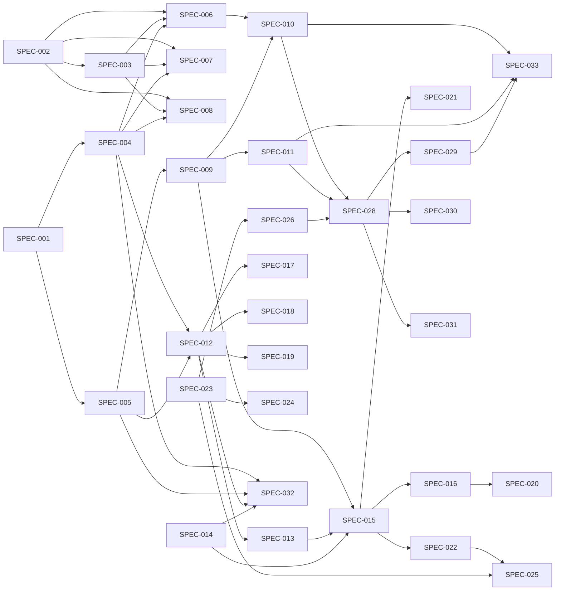
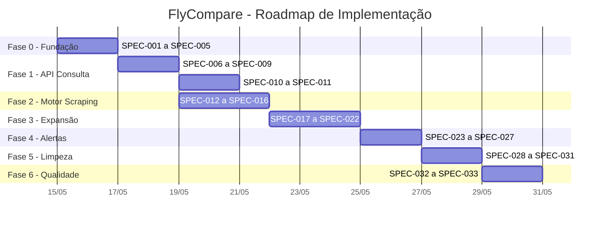

# 🗺️ Roadmap de Pivotagem — RedCode → FlyCompare

> **Propósito**: Roadmap completo com todas as **specs técnicas** necessárias para pivotar o RedCode (bilheteria de eventos) para FlyCompare (metabuscador de passagens aéreas). Cada spec é autossuficiente e contém tudo que uma IA precisa para implementar.
>
> **Público-alvo**: Qualquer IA ou desenvolvedor que precise executar a pivotagem.
>
> **Versão**: 1.0 | **Data**: 2026-05-14

---

## 📋 Visão Geral do Roadmap

```mermaid
flowchart LR
    subgraph F0["Fase 0 - Fundação"]
        S01["SPEC-001: Pastas"]
        S02["SPEC-002: Script SQL"]
        S03["SPEC-003: Seed Data"]
        S04["SPEC-004: Models C#"]
        S05["SPEC-005: DTOs"]
    end

    subgraph F1["Fase 1 - API Consulta"]
        S06["SPEC-006: GET aeroportos"]
        S07["SPEC-007: GET companhias"]
        S08["SPEC-008: GET rotas/populares"]
        S09["SPEC-009: GET voos/busca mock"]
        S10["SPEC-010: Frontend busca"]
        S11["SPEC-011: Frontend resultados"]
    end

    subgraph F2["Fase 2 - Motor Scraping"]
        S12["SPEC-012: Interface scraper"]
        S13["SPEC-013: Scraper Latam"]
        S14["SPEC-014: Normalizador"]
        S15["SPEC-015: Integrar scraping"]
        S16["SPEC-016: Cache memória"]
    end

    subgraph F3["Fase 3 - Expansão"]
        S17["SPEC-017: Scraper Gol"]
        S18["SPEC-018: Scraper Azul"]
        S19["SPEC-019: Scraper Decolar"]
        S20["SPEC-020: Cache Redis"]
        S21["SPEC-021: Histórico preços"]
        S22["SPEC-022: Agendador scraping"]
    end

    subgraph F4["Fase 4 - Alertas"]
        S23["SPEC-023: POST alertas"]
        S24["SPEC-024: GET alertas"]
        S25["SPEC-025: Job alertas"]
        S26["SPEC-026: Frontend alertas"]
        S27["SPEC-027: Filtros frontend"]
    end

    subgraph F5["Fase 5 - Limpeza"]
        S28["SPEC-028: Remover endpoints"]
        S29["SPEC-029: Remover páginas"]
        S30["SPEC-030: Remover tabelas"]
        S31["SPEC-031: Documentação"]
    end

    subgraph F6["Fase 6 - Qualidade"]
        S32["SPEC-032: Testes"]
        S33["SPEC-033: Layout final"]
    end

    F0 --> F1 --> F2 --> F3 --> F4 --> F5 --> F6
```



---

## 📦 Fase 0 — Fundação (Setup Inicial)

**Objetivo**: Preparar o projeto para receber o novo domínio, sem quebrar nada do existente.

---

### SPEC-001: Estrutura de Pastas do Novo Domínio

| Campo | Valor |
|---|---|
| **ID** | `SPEC-001` |
| **Fase** | 0 — Fundação |
| **Dependências** | Nenhuma |
| **Prioridade** | 🔴 Alta |
| **Tempo estimado** | Instantâneo |

#### Propósito
Criar a estrutura de diretórios para organizar o código do FlyCompare separado do legado.

#### Instruções Técnicas
Criar as seguintes pastas dentro de [`src/RedCodeApi/`](Red-code-master/src/RedCodeApi/):

```
src/RedCodeApi/
├── Models/
│   └── FlyCompare/           ← NOVO: modelos do domínio de voos
├── Services/
│   ├── Scrapers/             ← NOVO: scrapers de companhias aéreas
│   └── Cache/                ← NOVO: serviços de cache
└── Dtos/
    └── FlyCompare/           ← NOVO: DTOs de request/response
```

#### Critérios de Aceite
- [ ] Pastas criadas com os nomes exatos acima
- [ ] Estrutura visível no explorador de arquivos
- [ ] Nada quebrado (o projeto ainda compila)

---

### SPEC-002: Script SQL do Novo Banco (FlyCompare)

| Campo | Valor |
|---|---|
| **ID** | `SPEC-002` |
| **Fase** | 0 — Fundação |
| **Dependências** | `SPEC-001` |
| **Prioridade** | 🔴 Alta |

#### Propósito
Criar o script SQL com as 7 novas tabelas do FlyCompare, em um novo arquivo separado do legado.

#### Instruções Técnicas

1. Criar o arquivo [`db/script-flycompare.sql`](Red-code-master/db/script.sql) (ao lado do legado)
2. O script deve usar `IF DB_ID(...) IS NULL` / `IF OBJECT_ID(...) IS NULL` para ser **idempotente**
3. Criar as seguintes tabelas (modelagem completa abaixo):

##### Tabela: `CompanhiasAereas`
```sql
CREATE TABLE CompanhiasAereas (
    Id INT IDENTITY(1,1) PRIMARY KEY,
    Codigo VARCHAR(5) NOT NULL UNIQUE,   -- EX: LATAM, GOL, AZUL
    Nome VARCHAR(100) NOT NULL,
    SiteBase VARCHAR(500) NOT NULL,
    Ativo BIT NOT NULL DEFAULT 1,
    DataCadastro DATETIME DEFAULT GETDATE()
);
```

##### Tabela: `Aeroportos`
```sql
CREATE TABLE Aeroportos (
    Id INT IDENTITY(1,1) PRIMARY KEY,
    CodigoIATA VARCHAR(3) NOT NULL UNIQUE,  -- EX: GRU, REC, CGH
    Nome VARCHAR(200) NOT NULL,
    Cidade VARCHAR(100) NOT NULL,
    Estado VARCHAR(5),
    Pais VARCHAR(50) NOT NULL DEFAULT 'Brasil',
    Latitude DECIMAL(10,7),
    Longitude DECIMAL(10,7)
);
```

##### Tabela: `Rotas`
```sql
CREATE TABLE Rotas (
    Id INT IDENTITY(1,1) PRIMARY KEY,
    OrigemId INT NOT NULL,
    DestinoId INT NOT NULL,
    CONSTRAINT FK_Rotas_Origem FOREIGN KEY (OrigemId) REFERENCES Aeroportos(Id),
    CONSTRAINT FK_Rotas_Destino FOREIGN KEY (DestinoId) REFERENCES Aeroportos(Id),
    CONSTRAINT UQ_Rotas UNIQUE (OrigemId, DestinoId)
);
```

##### Tabela: `Voos`
```sql
CREATE TABLE Voos (
    Id INT IDENTITY(1,1) PRIMARY KEY,
    RotaId INT NOT NULL,
    CompanhiaId INT NOT NULL,
    CodigoVoo VARCHAR(20) NOT NULL,         -- EX: LA3354
    DataPartida DATETIME NOT NULL,
    DataChegada DATETIME NOT NULL,
    DuracaoMinutos INT NOT NULL,
    Paradas INT NOT NULL DEFAULT 0,
    AeroportoEscalaId INT NULL,
    Classe VARCHAR(50) DEFAULT 'Econômica',
    CONSTRAINT FK_Voos_Rota FOREIGN KEY (RotaId) REFERENCES Rotas(Id),
    CONSTRAINT FK_Voos_Companhia FOREIGN KEY (CompanhiaId) REFERENCES CompanhiasAereas(Id),
    CONSTRAINT FK_Voos_Escala FOREIGN KEY (AeroportoEscalaId) REFERENCES Aeroportos(Id)
);
```

##### Tabela: `Precos`
```sql
CREATE TABLE Precos (
    Id INT IDENTITY(1,1) PRIMARY KEY,
    VooId INT NOT NULL,
    Preco DECIMAL(18,2) NOT NULL,
    Taxas DECIMAL(18,2) NOT NULL DEFAULT 0,
    PrecoTotal DECIMAL(18,2) NOT NULL,
    Moeda VARCHAR(3) NOT NULL DEFAULT 'BRL',
    TipoTarifa VARCHAR(50) NOT NULL DEFAULT 'Econômica',
    BagagemIncluida BIT NOT NULL DEFAULT 0,
    FranquiaBagagemKg INT NULL,
    UrlDestino VARCHAR(1000) NOT NULL,
    Fonte VARCHAR(100) NOT NULL,
    DataColeta DATETIME NOT NULL DEFAULT GETDATE(),
    CONSTRAINT FK_Precos_Voo FOREIGN KEY (VooId) REFERENCES Voos(Id)
);
```

##### Tabela: `AlertasPreco`
```sql
CREATE TABLE AlertasPreco (
    Id INT IDENTITY(1,1) PRIMARY KEY,
    Email VARCHAR(200) NOT NULL,
    RotaId INT NOT NULL,
    PrecoAlvo DECIMAL(18,2) NOT NULL,
    Ativo BIT NOT NULL DEFAULT 1,
    DataCriacao DATETIME DEFAULT GETDATE(),
    CONSTRAINT FK_Alertas_Rota FOREIGN KEY (RotaId) REFERENCES Rotas(Id)
);
```

##### Tabela: `CacheBusca` (fallback)
```sql
CREATE TABLE CacheBusca (
    Id INT IDENTITY(1,1) PRIMARY KEY,
    ChaveCache VARCHAR(500) NOT NULL UNIQUE,
    ResultadoJson NVARCHAR(MAX) NOT NULL,
    DataExpiracao DATETIME NOT NULL,
    DataCriacao DATETIME DEFAULT GETDATE()
);
```

#### Critérios de Aceite
- [ ] Arquivo [`db/script-flycompare.sql`](Red-code-master/db/script.sql) criado
- [ ] Script é idempotente (pode rodar múltiplas vezes sem erro)
- [ ] 7 tabelas criadas com todas as colunas, FKs e constraints
- [ ] Script pode ser executado via `sqlcmd` ou SSMS

---

### SPEC-003: Seed Data (Aeroportos e Companhias)

| Campo | Valor |
|---|---|
| **ID** | `SPEC-003` |
| **Fase** | 0 — Fundação |
| **Dependências** | `SPEC-002` |
| **Prioridade** | 🔴 Alta |

#### Propósito
Popular as tabelas de referência (`Aeroportos`, `CompanhiasAereas`, `Rotas`) com dados reais para que a API possa funcionar.

#### Instruções Técnicas

Adicionar **no final do arquivo** [`db/script-flycompare.sql`](Red-code-master/db/script.sql), após a criação das tabelas, os seguintes inserts (também idempotentes com `IF NOT EXISTS`):

##### Companhias Aéreas Brasileiras
```sql
IF NOT EXISTS (SELECT 1 FROM CompanhiasAereas WHERE Codigo = 'LATAM')
    INSERT INTO CompanhiasAereas (Codigo, Nome, SiteBase) VALUES
    ('LATAM', 'LATAM Airlines Brasil', 'https://www.latam.com'),
    ('GOL', 'GOL Linhas Aéreas', 'https://www.voegol.com.br'),
    ('AZUL', 'Azul Linhas Aéreas', 'https://www.voeazul.com.br');
```

##### Aeroportos Brasileiros (principais)
```sql
IF NOT EXISTS (SELECT 1 FROM Aeroportos WHERE CodigoIATA = 'GRU')
    INSERT INTO Aeroportos (CodigoIATA, Nome, Cidade, Estado, Pais) VALUES
    ('GRU', 'Aeroporto Internacional de São Paulo', 'São Paulo', 'SP', 'Brasil'),
    ('CGH', 'Aeroporto de Congonhas', 'São Paulo', 'SP', 'Brasil'),
    ('GIG', 'Aeroporto Internacional do Rio de Janeiro', 'Rio de Janeiro', 'RJ', 'Brasil'),
    ('SDU', 'Aeroporto Santos Dumont', 'Rio de Janeiro', 'RJ', 'Brasil'),
    ('BSB', 'Aeroporto Internacional de Brasília', 'Brasília', 'DF', 'Brasil'),
    ('REC', 'Aeroporto Internacional do Recife', 'Recife', 'PE', 'Brasil'),
    ('SSA', 'Aeroporto Internacional de Salvador', 'Salvador', 'BA', 'Brasil'),
    ('CNF', 'Aeroporto Internacional de Belo Horizonte', 'Belo Horizonte', 'MG', 'Brasil'),
    ('POA', 'Aeroporto Internacional de Porto Alegre', 'Porto Alegre', 'RS', 'Brasil'),
    ('CWB', 'Aeroporto Internacional de Curitiba', 'Curitiba', 'PR', 'Brasil'),
    ('FOR', 'Aeroporto Internacional de Fortaleza', 'Fortaleza', 'CE', 'Brasil'),
    ('MAO', 'Aeroporto Internacional de Manaus', 'Manaus', 'AM', 'Brasil'),
    ('VIX', 'Aeroporto de Vitória', 'Vitória', 'ES', 'Brasil'),
    ('FLN', 'Aeroporto Internacional de Florianópolis', 'Florianópolis', 'SC', 'Brasil'),
    ('BEL', 'Aeroporto Internacional de Belém', 'Belém', 'PA', 'Brasil');
```

##### Rotas Populares
```sql
IF NOT EXISTS (SELECT 1 FROM Rotas WHERE OrigemId = (SELECT Id FROM Aeroportos WHERE CodigoIATA = 'GRU') AND DestinoId = (SELECT Id FROM Aeroportos WHERE CodigoIATA = 'REC'))
BEGIN
    DECLARE @GRU INT = (SELECT Id FROM Aeroportos WHERE CodigoIATA = 'GRU');
    DECLARE @CGH INT = (SELECT Id FROM Aeroportos WHERE CodigoIATA = 'CGH');
    DECLARE @GIG INT = (SELECT Id FROM Aeroportos WHERE CodigoIATA = 'GIG');
    DECLARE @SDU INT = (SELECT Id FROM Aeroportos WHERE CodigoIATA = 'SDU');
    DECLARE @BSB INT = (SELECT Id FROM Aeroportos WHERE CodigoIATA = 'BSB');
    DECLARE @REC INT = (SELECT Id FROM Aeroportos WHERE CodigoIATA = 'REC');
    DECLARE @SSA INT = (SELECT Id FROM Aeroportos WHERE CodigoIATA = 'SSA');
    DECLARE @CNF INT = (SELECT Id FROM Aeroportos WHERE CodigoIATA = 'CNF');
    DECLARE @POA INT = (SELECT Id FROM Aeroportos WHERE CodigoIATA = 'POA');

    INSERT INTO Rotas (OrigemId, DestinoId) VALUES
    (@GRU, @REC), (@REC, @GRU),
    (@GRU, @GIG), (@GIG, @GRU),
    (@CGH, @SDU), (@SDU, @CGH),
    (@GRU, @BSB), (@BSB, @GRU),
    (@GRU, @SSA), (@SSA, @GRU),
    (@CGH, @POA), (@POA, @CGH),
    (@GRU, @CNF), (@CNF, @GRU);
END
```

#### Critérios de Aceite
- [ ] 3 companhias aéreas inseridas (LATAM, GOL, AZUL)
- [ ] 15 aeroportos inseridos com códigos IATA reais
- [ ] Rotas populares inseridas (ida e volta)
- [ ] Todos os inserts são idempotentes

---

### SPEC-004: Models C# do Novo Domínio

| Campo | Valor |
|---|---|
| **ID** | `SPEC-004` |
| **Fase** | 0 — Fundação |
| **Dependências** | `SPEC-001` |
| **Prioridade** | 🔴 Alta |

#### Propósito
Criar as classes C# que representam o novo domínio de voos, aeroportos, companhias e preços.

#### Instruções Técnicas

Criar os seguintes arquivos em [`src/RedCodeApi/Models/FlyCompare/`](Red-code-master/src/RedCodeApi/):

##### `Models/FlyCompare/Aeroporto.cs`
```csharp
namespace RedCodeApi.Models.FlyCompare;

public class Aeroporto
{
    public int Id { get; set; }
    public string CodigoIATA { get; set; } = string.Empty;
    public string Nome { get; set; } = string.Empty;
    public string Cidade { get; set; } = string.Empty;
    public string? Estado { get; set; }
    public string Pais { get; set; } = "Brasil";
    public decimal? Latitude { get; set; }
    public decimal? Longitude { get; set; }
}
```

##### `Models/FlyCompare/CompanhiaAerea.cs`
```csharp
namespace RedCodeApi.Models.FlyCompare;

public class CompanhiaAerea
{
    public int Id { get; set; }
    public string Codigo { get; set; } = string.Empty;
    public string Nome { get; set; } = string.Empty;
    public string SiteBase { get; set; } = string.Empty;
    public bool Ativo { get; set; } = true;
    public DateTime DataCadastro { get; set; }
}
```

##### `Models/FlyCompare/Voo.cs`
```csharp
namespace RedCodeApi.Models.FlyCompare;

public class Voo
{
    public int Id { get; set; }
    public int RotaId { get; set; }
    public int CompanhiaId { get; set; }
    public string CodigoVoo { get; set; } = string.Empty;
    public DateTime DataPartida { get; set; }
    public DateTime DataChegada { get; set; }
    public int DuracaoMinutos { get; set; }
    public int Paradas { get; set; }
    public int? AeroportoEscalaId { get; set; }
    public string Classe { get; set; } = "Econômica";
}
```

##### `Models/FlyCompare/PrecoVoo.cs`
```csharp
namespace RedCodeApi.Models.FlyCompare;

public class PrecoVoo
{
    public int Id { get; set; }
    public int VooId { get; set; }
    public decimal Preco { get; set; }
    public decimal Taxas { get; set; }
    public decimal PrecoTotal { get; set; }
    public string Moeda { get; set; } = "BRL";
    public string TipoTarifa { get; set; } = "Econômica";
    public bool BagagemIncluida { get; set; }
    public int? FranquiaBagagemKg { get; set; }
    public string UrlDestino { get; set; } = string.Empty;
    public string Fonte { get; set; } = string.Empty;
    public DateTime DataColeta { get; set; }
}
```

##### `Models/FlyCompare/Rota.cs`
```csharp
namespace RedCodeApi.Models.FlyCompare;

public class Rota
{
    public int Id { get; set; }
    public int OrigemId { get; set; }
    public int DestinoId { get; set; }
    // Propriedades de navegação (populadas via JOIN)
    public string? OrigemCodigo { get; set; }
    public string? DestinoCodigo { get; set; }
    public string? OrigemCidade { get; set; }
    public string? DestinoCidade { get; set; }
}
```

##### `Models/FlyCompare/AlertaPreco.cs`
```csharp
namespace RedCodeApi.Models.FlyCompare;

public class AlertaPreco
{
    public int Id { get; set; }
    public string Email { get; set; } = string.Empty;
    public int RotaId { get; set; }
    public decimal PrecoAlvo { get; set; }
    public bool Ativo { get; set; } = true;
    public DateTime DataCriacao { get; set; }
}
```

#### Critérios de Aceite
- [ ] 6 arquivos de model criados no namespace `RedCodeApi.Models.FlyCompare`
- [ ] Propriedades com tipos e valores padrão corretos
- [ ] Projeto compila sem erros

---

### SPEC-005: DTOs de Request/Response

| Campo | Valor |
|---|---|
| **ID** | `SPEC-005` |
| **Fase** | 0 — Fundação |
| **Dependências** | `SPEC-001` |
| **Prioridade** | 🔴 Alta |

#### Propósito
Criar os DTOs (Data Transfer Objects) para as requests e responses da API FlyCompare.

#### Instruções Técnicas

Criar os seguintes arquivos em [`src/RedCodeApi/Dtos/FlyCompare/`](Red-code-master/src/RedCodeApi/):

##### `Dtos/FlyCompare/BuscaRequest.cs`
```csharp
namespace RedCodeApi.Dtos.FlyCompare;

public class BuscaRequest
{
    public string Origem { get; set; } = string.Empty;   // Código IATA (ex: GRU)
    public string Destino { get; set; } = string.Empty;  // Código IATA (ex: REC)
    public DateTime DataPartida { get; set; }
    public DateTime? DataVolta { get; set; }
    public int Passageiros { get; set; } = 1;
    public string Classe { get; set; } = "Econômica";
}
```

##### `Dtos/FlyCompare/ResultadoBusca.cs`
```csharp
namespace RedCodeApi.Dtos.FlyCompare;

public class ResultadoBusca
{
    public string CodigoVoo { get; set; } = string.Empty;
    public string Companhia { get; set; } = string.Empty;
    public string Origem { get; set; } = string.Empty;
    public string Destino { get; set; } = string.Empty;
    public DateTime Partida { get; set; }
    public DateTime Chegada { get; set; }
    public int DuracaoMinutos { get; set; }
    public int Paradas { get; set; }
    public decimal PrecoTotal { get; set; }
    public decimal PrecoSemTaxas { get; set; }
    public decimal Taxas { get; set; }
    public string TipoTarifa { get; set; } = string.Empty;
    public bool BagagemIncluida { get; set; }
    public string UrlCompra { get; set; } = string.Empty;
    public string Fonte { get; set; } = string.Empty;
}
```

##### `Dtos/FlyCompare/AlertaRequest.cs`
```csharp
namespace RedCodeApi.Dtos.FlyCompare;

public class AlertaRequest
{
    public string Email { get; set; } = string.Empty;
    public string Origem { get; set; } = string.Empty;   // Código IATA
    public string Destino { get; set; } = string.Empty;  // Código IATA
    public decimal PrecoAlvo { get; set; }
}
```

##### `Dtos/FlyCompare/PrecoHistoricoResponse.cs`
```csharp
namespace RedCodeApi.Dtos.FlyCompare;

public class PrecoHistoricoResponse
{
    public string CodigoVoo { get; set; } = string.Empty;
    public string Companhia { get; set; } = string.Empty;
    public List<PrecoHistoricoPonto> Precos { get; set; } = new();
}

public class PrecoHistoricoPonto
{
    public decimal Preco { get; set; }
    public DateTime DataColeta { get; set; }
    public string Fonte { get; set; } = string.Empty;
}
```

#### Critérios de Aceite
- [ ] 4 arquivos DTO criados no namespace `RedCodeApi.Dtos.FlyCompare`
- [ ] `BuscaRequest` tem validação implícita (campos não vazios)
- [ ] `ResultadoBusca` contempla todos os campos que o frontend precisa
- [ ] Projeto compila sem erros

---

## 🔎 Fase 1 — API de Consulta (Dados Estáticos/Mockados)

**Objetivo**: Implementar endpoints que retornam dados do banco (aeroportos, companhias) e dados mockados (voos), para que o frontend já funcione mesmo sem scraping.

---

### SPEC-006: Endpoint GET /api/aeroportos e Autocomplete

| Campo | Valor |
|---|---|
| **ID** | `SPEC-006` |
| **Fase** | 1 — API de Consulta |
| **Dependências** | `SPEC-002`, `SPEC-003`, `SPEC-004` |
| **Prioridade** | 🔴 Alta |

#### Propósito
Implementar endpoints para listar aeroportos e buscar por nome/cidade, usado no autocomplete do frontend.

#### Instruções Técnicas

Adicionar no arquivo [`src/RedCodeApi/Program.cs`](Red-code-master/src/RedCodeApi/Program.cs):

```csharp
// ==========================================
// MÓDULO FLYCOMPARE - AEROPORTOS
// ==========================================

// Listar todos os aeroportos
app.MapGet("/api/aeroportos", async (SqlConnection db) =>
{
    var aeroportos = await db.QueryAsync<Aeroporto>(
        "SELECT * FROM Aeroportos ORDER BY Cidade, Nome");
    return Results.Ok(aeroportos);
});

// Buscar aeroportos por nome/cidade/código (autocomplete)
app.MapGet("/api/aeroportos/busca", async (string q, SqlConnection db) =>
{
    if (string.IsNullOrWhiteSpace(q) || q.Length < 2)
        return Results.BadRequest("Erro: Termo de busca deve ter pelo menos 2 caracteres.");

    var aeroportos = await db.QueryAsync<Aeroporto>(
        @"SELECT * FROM Aeroportos 
          WHERE Nome LIKE @Q OR Cidade LIKE @Q OR CodigoIATA LIKE @Q 
          ORDER BY Cidade, Nome",
        new { Q = $"%{q}%" });
    return Results.Ok(aeroportos);
});
```

**Importante**: Para injetar `SqlConnection` diretamente nos endpoints, você precisará registrar o serviço de conexão. A abordagem mais simples é manter `using var db = new SqlConnection(connStr);` dentro de cada handler (como o código legado já faz). Ou registrar um `IDbConnection` factory no DI:

```csharp
// Antes de var app = builder.Build();
builder.Services.AddTransient<SqlConnection>(_ => new SqlConnection(connStr));
```

#### Critérios de Aceite
- [ ] `GET /api/aeroportos` retorna lista de aeroportos
- [ ] `GET /api/aeroportos/busca?q=GRU` retorna apenas aeroportos que contêm "GRU"
- [ ] `GET /api/aeroportos/busca?q=São` retorna aeroportos de São Paulo
- [ `GET /api/aeroportos/busca?q=a` (1 caractere) retorna `400 Bad Request`
- [ ] Retorna `200` com array vazio se não encontrar

---

### SPEC-007: Endpoint GET /api/companhias

| Campo | Valor |
|---|---|
| **ID** | `SPEC-007` |
| **Fase** | 1 — API de Consulta |
| **Dependências** | `SPEC-002`, `SPEC-003`, `SPEC-004` |
| **Prioridade** | 🔴 Alta |

#### Propósito
Listar todas as companhias aéreas cadastradas.

#### Instruções Técnicas

Adicionar em [`src/RedCodeApi/Program.cs`](Red-code-master/src/RedCodeApi/Program.cs):

```csharp
// ==========================================
// MÓDULO FLYCOMPARE - COMPANHIAS
// ==========================================
app.MapGet("/api/companhias", async (SqlConnection db) =>
{
    var companhias = await db.QueryAsync<CompanhiaAerea>(
        "SELECT * FROM CompanhiasAereas WHERE Ativo = 1 ORDER BY Nome");
    return Results.Ok(companhias);
});
```

#### Critérios de Aceite
- [ ] `GET /api/companhias` retorna lista com LATAM, GOL, AZUL
- [ ] Retorna apenas companhias ativas (`Ativo = 1`)

---

### SPEC-008: Endpoint GET /api/rotas/populares

| Campo | Valor |
|---|---|
| **ID** | `SPEC-008` |
| **Fase** | 1 — API de Consulta |
| **Dependências** | `SPEC-002`, `SPEC-003`, `SPEC-004` |
| **Prioridade** | 🟡 Média |

#### Propósito
Retornar as rotas mais populares cadastradas, para sugerir no frontend.

#### Instruções Técnicas

Adicionar em [`src/RedCodeApi/Program.cs`](Red-code-master/src/RedCodeApi/Program.cs):

```csharp
// ==========================================
// MÓDULO FLYCOMPARE - ROTAS
// ==========================================
app.MapGet("/api/rotas/populares", async (SqlConnection db) =>
{
    var rotas = await db.QueryAsync<Rota>(
        @"SELECT r.Id, r.OrigemId, r.DestinoId,
                 a1.CodigoIATA AS OrigemCodigo, a1.Cidade AS OrigemCidade,
                 a2.CodigoIATA AS DestinoCodigo, a2.Cidade AS DestinoCidade
          FROM Rotas r
          INNER JOIN Aeroportos a1 ON r.OrigemId = a1.Id
          INNER JOIN Aeroportos a2 ON r.DestinoId = a2.Id
          ORDER BY a1.Cidade, a2.Cidade");
    return Results.Ok(rotas);
});
```

#### Critérios de Aceite
- [ ] `GET /api/rotas/populares` retorna lista de rotas com origens e destinos populados
- [ ] Cada rota contém `origemCodigo`, `origemCidade`, `destinoCodigo`, `destinoCidade`

---

### SPEC-009: Endpoint GET /api/voos/busca (Mock)

| Campo | Valor |
|---|---|
| **ID** | `SPEC-009` |
| **Fase** | 1 — API de Consulta |
| **Dependências** | `SPEC-005`, `SPEC-006`, `SPEC-007`, `SPEC-008` |
| **Prioridade** | 🔴 Alta |

#### Propósito
Implementar o endpoint principal de busca de voos, inicialmente retornando dados mockados para que o frontend possa ser desenvolvido e testado.

#### Instruções Técnicas

Adicionar em [`src/RedCodeApi/Program.cs`](Red-code-master/src/RedCodeApi/Program.cs):

```csharp
// ==========================================
// MÓDULO FLYCOMPARE - BUSCA DE VOOS
// ==========================================
app.MapGet("/api/voos/busca", async (string origem, string destino, DateTime dataPartida, SqlConnection db) =>
{
    // Validações básicas
    if (string.IsNullOrWhiteSpace(origem) || origem.Length != 3)
        return Results.BadRequest("Erro: Código IATA de origem inválido.");
    if (string.IsNullOrWhiteSpace(destino) || destino.Length != 3)
        return Results.BadRequest("Erro: Código IATA de destino inválido.");
    if (dataPartida < DateTime.Today)
        return Results.BadRequest("Erro: Data de partida não pode ser no passado.");

    // --- MOCK: Retorna dados simulados ---
    // (Será substituído pelo scraping real na SPEC-015)

    var random = new Random(origem.GetHashCode() + destino.GetHashCode() + dataPartida.DayOfYear);
    var mockVoos = new List<ResultadoBusca>();

    string[] companhias = { "LATAM", "GOL", "AZUL" };
    string[][] prefixos = { new[] { "LA", "JJ" }, new[] { "G3" }, new[] { "AD" } };
    int[][] duracoes = {
        new[] { 180, 195, 210 },  // LATAM
        new[] { 175, 190, 205 },  // GOL
        new[] { 185, 200, 215 }   // AZUL
    };

    for (int i = 0; i < 6; i++)
    {
        int compIndex = i % 3;
        int variante = i / 3;
        string codigo = $"{prefixos[compIndex][0]}{random.Next(3000, 9999)}";
        int duracao = duracoes[compIndex][variante] + random.Next(-10, 10);
        decimal precoBase = random.Next(300, 1500);
        decimal taxas = precoBase * 0.1m;
        bool bagagem = i % 2 == 0;

        mockVoos.Add(new ResultadoBusca
        {
            CodigoVoo = codigo,
            Companhia = companhias[compIndex],
            Origem = origem.ToUpper(),
            Destino = destino.ToUpper(),
            Partida = dataPartida.AddHours(6 + i * 2),
            Chegada = dataPartida.AddHours(6 + i * 2).AddMinutes(duracao),
            DuracaoMinutos = duracao,
            Paradas = variante,
            PrecoTotal = precoBase + taxas,
            PrecoSemTaxas = precoBase,
            Taxas = taxas,
            TipoTarifa = bagagem ? "Econômica" : "Promo",
            BagagemIncluida = bagagem,
            UrlCompra = $"https://www.{companhias[compIndex].ToLower()}.com.br/busca?origem={origem}&destino={destino}",
            Fonte = $"mock-{companhias[compIndex].ToLower()}"
        });
    }

    return Results.Ok(mockVoos.OrderBy(v => v.PrecoTotal).ToList());
});
```

#### Critérios de Aceite
- [ ] `GET /api/voos/busca?origem=GRU&destino=REC&dataPartida=2026-06-15` retorna 6 voos mockados
- [ ] Resultados ordenados por preço (menor primeiro)
- [ ] Validação de parâmetros (código IATA deve ter 3 caracteres)
- [ ] Data passada retorna `400 Bad Request`
- [ ] Estrutura do response compatível com [`ResultadoBusca`](Red-code-master/src/RedCodeApi/Dtos/FlyCompare/ResultadoBusca.cs)

---

### SPEC-010: Página Blazor de Busca de Voos

| Campo | Valor |
|---|---|
| **ID** | `SPEC-010` |
| **Fase** | 1 — API de Consulta |
| **Dependências** | `SPEC-006`, `SPEC-009` |
| **Prioridade** | 🔴 Alta |

#### Propósito
Criar a página inicial do FlyCompare com um formulário de busca de voos (origem, destino, data).

#### Instruções Técnicas

1. Criar [`src/RedCodeFront/Pages/BuscarVoos.razor`](Red-code-master/src/RedCodeFront/Pages/):

```razor
@page "/"
@using System.Net.Http
@using System.Net.Http.Json
@using RedCodeFront.Models.FlyCompare
@inject HttpClient Http

<PageTitle>FlyCompare — Buscar Passagens</PageTitle>

<div class="fc-hero">
    <div class="fc-hero-badge">✈️ Metabuscador de Passagens Aéreas</div>
    <h1 class="fc-hero-title">FlyCompare</h1>
    <p class="fc-hero-sub">Compare preços de passagens aéreas em múltiplas companhias</p>
</div>

<div class="fc-search-card">
    <h3>Buscar Passagens</h3>
    <div class="fc-search-form">
        <div class="fc-search-row">
            <div class="fc-field">
                <label>Origem</label>
                <input type="text" @bind="origem"
                       placeholder="Ex: GRU, CGH, SDU"
                       maxlength="3"
                       class="fc-input fc-input-iata"
                       @oninput="OnOrigemInput" />
                @if (sugestoesOrigem?.Any() == true)
                {
                    <div class="fc-autocomplete">
                        @foreach (var a in sugestoesOrigem.Take(5))
                        {
                            <div class="fc-autocomplete-item" @onclick="() => SelecionarOrigem(a)">
                                @a.CodigoIATA - @a.Cidade, @a.Estado
                            </div>
                        }
                    </div>
                }
            </div>
            <div class="fc-field">
                <label>Destino</label>
                <input type="text" @bind="destino"
                       placeholder="Ex: REC, BSB, GIG"
                       maxlength="3"
                       class="fc-input fc-input-iata"
                       @oninput="OnDestinoInput" />
                @if (sugestoesDestino?.Any() == true)
                {
                    <div class="fc-autocomplete">
                        @foreach (var a in sugestoesDestino.Take(5))
                        {
                            <div class="fc-autocomplete-item" @onclick="() => SelecionarDestino(a)">
                                @a.CodigoIATA - @a.Cidade, @a.Estado
                            </div>
                        }
                    </div>
                }
            </div>
            <div class="fc-field">
                <label>Data de Ida</label>
                <input type="date" @bind="dataPartida"
                       class="fc-input" />
            </div>
            <div class="fc-field">
                <label>Data de Volta</label>
                <input type="date" @bind="dataVolta"
                       class="fc-input" />
                <small class="fc-field-hint">Opcional</small>
            </div>
        </div>
        <button class="fc-btn fc-btn-primary" @onclick="BuscarVoos" disabled="@isLoading">
            @(isLoading ? "Buscando..." : "🔍 Buscar Passagens")
        </button>
    </div>

    @if (erro != null)
    {
        <div class="fc-error">@erro</div>
    }
</div>

@if (resultados?.Any() == true)
{
    <div class="fc-results-section">
        <h3>@resultados.Count passagen(s) encontrada(s)</h3>
        <table class="fc-results-table">
            <thead>
                <tr>
                    <th>Companhia</th>
                    <th>Voo</th>
                    <th>Partida</th>
                    <th>Chegada</th>
                    <th>Duração</th>
                    <th>Preço Total</th>
                    <th>Bagagem</th>
                    <th></th>
                </tr>
            </thead>
            <tbody>
                @foreach (var v in resultados)
                {
                    <tr>
                        <td><strong>@v.Companhia</strong></td>
                        <td>@v.CodigoVoo</td>
                        <td>@v.Partida.ToString("dd/MM HH:mm")</td>
                        <td>@v.Chegada.ToString("dd/MM HH:mm")</td>
                        <td>@(v.DuracaoMinutos / 60)h@(v.DuracaoMinutos % 60)m</td>
                        <td class="fc-price">R$ @v.PrecoTotal.ToString("N2")</td>
                        <td>@(v.BagagemIncluida ? "✅" : "❌")</td>
                        <td><a href="@v.UrlCompra" target="_blank" class="fc-btn fc-btn-sm">Comprar</a></td>
                    </tr>
                }
            </tbody>
        </table>
    </div>
}

@code {
    private string origem = "";
    private string destino = "";
    private string dataPartida = DateTime.Today.AddDays(30).ToString("yyyy-MM-dd");
    private string? dataVolta;
    private bool isLoading;
    private string? erro;
    private List<ResultadoBusca>? resultados;

    private List<Aeroporto>? sugestoesOrigem;
    private List<Aeroporto>? sugestoesDestino;

    private async Task OnOrigemInput(ChangeEventArgs e)
    {
        var val = e.Value?.ToString()?.ToUpper() ?? "";
        origem = val;
        if (val.Length >= 2)
            sugestoesOrigem = await Http.GetFromJsonAsync<List<Aeroporto>>($"api/aeroportos/busca?q={val}");
        else
            sugestoesOrigem = null;
    }

    private async Task OnDestinoInput(ChangeEventArgs e)
    {
        var val = e.Value?.ToString()?.ToUpper() ?? "";
        destino = val;
        if (val.Length >= 2)
            sugestoesDestino = await Http.GetFromJsonAsync<List<Aeroporto>>($"api/aeroportos/busca?q={val}");
        else
            sugestoesDestino = null;
    }

    private void SelecionarOrigem(Aeroporto a)
    {
        origem = a.CodigoIATA;
        sugestoesOrigem = null;
    }

    private void SelecionarDestino(Aeroporto a)
    {
        destino = a.CodigoIATA;
        sugestoesDestino = null;
    }

    private async Task BuscarVoos()
    {
        if (string.IsNullOrWhiteSpace(origem) || origem.Length != 3)
        {
            erro = "Informe o código IATA de origem (ex: GRU).";
            return;
        }
        if (string.IsNullOrWhiteSpace(destino) || destino.Length != 3)
        {
            erro = "Informe o código IATA de destino (ex: REC).";
            return;
        }
        if (string.IsNullOrWhiteSpace(dataPartida))
        {
            erro = "Informe a data de partida.";
            return;
        }

        isLoading = true;
        erro = null;

        try
        {
            var url = $"api/voos/busca?origem={origem}&destino={destino}&dataPartida={dataPartida}";
            resultados = await Http.GetFromJsonAsync<List<ResultadoBusca>>(url);
        }
        catch (Exception ex)
        {
            erro = $"Erro ao buscar voos: {ex.Message}";
        }
        finally
        {
            isLoading = false;
        }
    }
}
```

2. Criar [`src/RedCodeFront/Models/FlyCompare/`](Red-code-master/src/RedCodeFront/Models/) com os models do frontend:

##### `Models/FlyCompare/Aeroporto.cs`
```csharp
namespace RedCodeFront.Models.FlyCompare;

public class Aeroporto
{
    public int Id { get; set; }
    public string CodigoIATA { get; set; } = string.Empty;
    public string Nome { get; set; } = string.Empty;
    public string Cidade { get; set; } = string.Empty;
    public string? Estado { get; set; }
    public string Pais { get; set; } = "Brasil";
}
```

##### `Models/FlyCompare/ResultadoBusca.cs`
```csharp
namespace RedCodeFront.Models.FlyCompare;

public class ResultadoBusca
{
    public string CodigoVoo { get; set; } = string.Empty;
    public string Companhia { get; set; } = string.Empty;
    public string Origem { get; set; } = string.Empty;
    public string Destino { get; set; } = string.Empty;
    public DateTime Partida { get; set; }
    public DateTime Chegada { get; set; }
    public int DuracaoMinutos { get; set; }
    public int Paradas { get; set; }
    public decimal PrecoTotal { get; set; }
    public string TipoTarifa { get; set; } = string.Empty;
    public bool BagagemIncluida { get; set; }
    public string UrlCompra { get; set; } = string.Empty;
    public string Fonte { get; set; } = string.Empty;
}
```

3. Atualizar [`src/RedCodeFront/_Imports.razor`](Red-code-master/src/RedCodeFront/_Imports.razor) adicionando:
```razor
@using RedCodeFront.Models.FlyCompare
```

#### Critérios de Aceite
- [ ] Página inicial (`/`) exibe formulário de busca
- [ ] Autocomplete de aeroportos funciona ao digitar (mínimo 2 caracteres)
- [ ] Valida campos obrigatórios antes de chamar a API
- [ ] Resultados exibidos em tabela ordenada por preço
- [ ] Botão de "Comprar" abre link externo

---

### SPEC-011: Página Blazor de Resultados de Busca

| Campo | Valor |
|---|---|
| **ID** | `SPEC-011` |
| **Fase** | 1 — API de Consulta |
| **Dependências** | `SPEC-009`, `SPEC-010` |
| **Prioridade** | 🟡 Média |

#### Propósito
Criar uma página dedicada para exibir resultados de busca com filtros e ordenação.

#### Instruções Técnicas

Criar [`src/RedCodeFront/Pages/ResultadosBusca.razor`](Red-code-master/src/RedCodeFront/Pages/):

```razor
@page "/resultados"
@page "/resultados/{Origem}/{Destino}/{DataPartida}"
@using System.Net.Http
@using System.Net.Http.Json
@using RedCodeFront.Models.FlyCompare
@inject HttpClient Http
@inject NavigationManager Navigation

<PageTitle>FlyCompare — Resultados</PageTitle>

@if (isLoading)
{
    <div class="fc-loading">
        <div class="fc-spinner"></div>
        <p>Buscando voos de @Origem para @Destino...</p>
    </div>
}
else if (erro != null)
{
    <div class="fc-error">@erro</div>
}
else if (resultados == null || !resultados.Any())
{
    <div class="fc-empty">
        <p>Nenhum voo encontrado para @Origem → @Destino em @dataPartidaFormatada.</p>
        <a href="/" class="fc-btn">Nova Busca</a>
    </div>
}
else
{
    <div class="fc-results-header">
        <h2>@Origem → @Destino</h2>
        <p>@dataPartidaFormatada · @resultados.Count passagen(ns) encontrada(s)</p>
    </div>

    <div class="fc-filters">
        <select @bind="filtroCompanhia" class="fc-filter-select">
            <option value="">Todas as companhias</option>
            @foreach (var c in companhias)
            {
                <option value="@c">@c</option>
            }
        </select>
        <select @bind="filtroParadas" class="fc-filter-select">
            <option value="">Qualquer parada</option>
            <option value="0">Direto</option>
            <option value="1">1 parada</option>
            <option value="2">2+ paradas</option>
        </select>
        <select @bind="ordenacao" class="fc-filter-select">
            <option value="preco">Menor Preço</option>
            <option value="duracao">Menor Duração</option>
            <option value="partida">Partida</option>
        </select>
    </div>

    <div class="fc-results-list">
        @foreach (var v in resultadosFiltrados)
        {
            <div class="fc-result-card">
                <div class="fc-company">
                    <strong>@v.Companhia</strong>
                    <span>@v.CodigoVoo</span>
                </div>
                <div class="fc-times">
                    <div class="fc-time-block">
                        <div class="fc-time">@v.Partida.ToString("HH:mm")</div>
                        <div class="fc-airport">@v.Origem</div>
                    </div>
                    <div class="fc-duration">
                        <div class="fc-duration-bar"></div>
                        <span>@(v.DuracaoMinutos / 60)h @(v.DuracaoMinutos % 60)m</span>
                        <div class="fc-stops">
                            @(v.Paradas == 0 ? "Direto" : $"{v.Paradas} parada(s)")
                        </div>
                    </div>
                    <div class="fc-time-block fc-time-right">
                        <div class="fc-time">@v.Chegada.ToString("HH:mm")</div>
                        <div class="fc-airport">@v.Destino</div>
                    </div>
                </div>
                <div class="fc-price-block">
                    <div class="fc-price-value">R$ @v.PrecoTotal.ToString("N2")</div>
                    <div class="fc-price-detail">
                        @(v.BagagemIncluida ? "Com bagagem" : "Sem bagagem")
                    </div>
                    <a href="@v.UrlCompra" target="_blank" class="fc-btn fc-btn-buy">Comprar</a>
                </div>
            </div>
        }
    </div>
}

@code {
    [Parameter] public string? Origem { get; set; }
    [Parameter] public string? Destino { get; set; }
    [Parameter] public string? DataPartida { get; set; }

    private bool isLoading;
    private string? erro;
    private List<ResultadoBusca>? resultados;
    private string filtroCompanhia = "";
    private string filtroParadas = "";
    private string ordenacao = "preco";
    private List<string> companhias = new();

    private string dataPartidaFormatada
    {
        get
        {
            if (DateTime.TryParse(DataPartida, out var dt))
                return dt.ToString("dd/MM/yyyy");
            return DataPartida ?? "";
        }
    }

    private IEnumerable<ResultadoBusca> resultadosFiltrados
    {
        get
        {
            if (resultados == null) return Enumerable.Empty<ResultadoBusca>();

            var query = resultados.AsEnumerable();

            if (!string.IsNullOrEmpty(filtroCompanhia))
                query = query.Where(v => v.Companhia == filtroCompanhia);

            if (!string.IsNullOrEmpty(filtroParadas))
            {
                int maxParadas = int.Parse(filtroParadas);
                query = maxParadas >= 2
                    ? query.Where(v => v.Paradas >= 2)
                    : query.Where(v => v.Paradas == maxParadas);
            }

            query = ordenacao switch
            {
                "duracao" => query.OrderBy(v => v.DuracaoMinutos),
                "partida" => query.OrderBy(v => v.Partida),
                _ => query.OrderBy(v => v.PrecoTotal)
            };

            return query;
        }
    }

    protected override async Task OnInitializedAsync()
    {
        if (string.IsNullOrEmpty(Origem) || string.IsNullOrEmpty(Destino) || string.IsNullOrEmpty(DataPartida))
        {
            Navigation.NavigateTo("/");
            return;
        }

        isLoading = true;
        try
        {
            resultados = await Http.GetFromJsonAsync<List<ResultadoBusca>>(
                $"api/voos/busca?origem={Origem}&destino={Destino}&dataPartida={DataPartida}");

            if (resultados != null)
                companhias = resultados.Select(v => v.Companhia).Distinct().ToList();
        }
        catch (Exception ex)
        {
            erro = $"Erro: {ex.Message}";
        }
        finally
        {
            isLoading = false;
        }
    }
}
```

#### Critérios de Aceite
- [ ] Rota navegável: `/resultados/GRU/REC/2026-06-15`
- [ ] Exibe resultados com horários de partida/chegada
- [ ] Filtros por companhia e paradas funcionam
- [ ] Ordenação por preço, duração, horário
- [ ] Loading state com spinner

---

## 🕷️ Fase 2 — Motor de Scraping

**Objetivo**: Implementar scraping real de companhias aéreas, começando com uma prova de conceito (Latam).

---

### SPEC-012: Interface IVooScraper e Registro DI

| Campo | Valor |
|---|---|
| **ID** | `SPEC-012` |
| **Fase** | 2 — Motor de Scraping |
| **Dependências** | `SPEC-005` |
| **Prioridade** | 🔴 Alta |

#### Propósito
Criar o contrato que todos os scrapers devem implementar, permitindo que novos scrapers sejam adicionados sem modificar o código existente (Strategy Pattern).

#### Instruções Técnicas

Criar [`src/RedCodeApi/Services/Scrapers/IVooScraper.cs`](Red-code-master/src/RedCodeApi/Services/Scrapers/):

```csharp
namespace RedCodeApi.Services.Scrapers;

using RedCodeApi.Dtos.FlyCompare;

/// <summary>
/// Interface que define o contrato para scrapers de voos.
/// Cada fonte (Latam, Gol, Azul, Decolar) implementa esta interface.
/// </summary>
public interface IVooScraper
{
    /// <summary>
    /// Nome da fonte (ex: "Latam", "Gol", "Azul", "Decolar").
    /// </summary>
    string Fonte { get; }

    /// <summary>
    /// Executa a busca de voos na fonte.
    /// </summary>
    /// <param name="origem">Código IATA de origem (ex: GRU)</param>
    /// <param name="destino">Código IATA de destino (ex: REC)</param>
    /// <param name="dataPartida">Data de partida</param>
    /// <param name="cancellationToken">Token de cancelamento</param>
    /// <returns>Lista de resultados de busca</returns>
    Task<List<ResultadoBusca>> BuscarVoosAsync(
        string origem,
        string destino,
        DateTime dataPartida,
        CancellationToken cancellationToken = default
    );
}
```

Registrar no [`Program.cs`](Red-code-master/src/RedCodeApi/Program.cs):

```csharp
// Registro dos scrapers no DI
builder.Services.AddScoped<IVooScraper, ScraperLatam>();
builder.Services.AddScoped<IVooScraper, ScraperGol>();
builder.Services.AddScoped<IVooScraper, ScraperAzul>();
// Scrapers mais complexos serão adicionados nas fases seguintes
```

#### Critérios de Aceite
- [ ] Interface `IVooScraper` criada no namespace correto
- [ ] Propriedade `Fonte` retorna identificador único
- [ ] Método `BuscarVoosAsync` com parâmetros de busca e CT
- [ ] Projeto compila

---

### SPEC-013: Scraper Latam (Prova de Conceito)

| Campo | Valor |
|---|---|
| **ID** | `SPEC-013` |
| **Fase** | 2 — Motor de Scraping |
| **Dependências** | `SPEC-012` |
| **Prioridade** | 🔴 Alta |

#### Propósito
Implementar o primeiro scraper real (Latam) como prova de conceito do motor de scraping.

#### Instruções Técnicas

Criar [`src/RedCodeApi/Services/Scrapers/ScraperLatam.cs`](Red-code-master/src/RedCodeApi/Services/Scrapers/):

```csharp
namespace RedCodeApi.Services.Scrapers;

using System.Text.Json;
using HtmlAgilityPack;
using RedCodeApi.Dtos.FlyCompare;

/// <summary>
/// Scraper para o site da LATAM Airlines.
/// Estratégia: HttpClient + HTML Agility Pack para parsear HTML.
/// </summary>
public class ScraperLatam : IVooScraper
{
    private readonly HttpClient _httpClient;
    private readonly ILogger<ScraperLatam> _logger;

    public string Fonte => "Latam";

    public ScraperLatam(HttpClient httpClient, ILogger<ScraperLatam> logger)
    {
        _httpClient = httpClient;
        _logger = logger;
    }

    public async Task<List<ResultadoBusca>> BuscarVoosAsync(
        string origem,
        string destino,
        DateTime dataPartida,
        CancellationToken cancellationToken = default)
    {
        var resultados = new List<ResultadoBusca>();

        try
        {
            // 1. Construir URL de busca
            // NOTA: URLs reais mudam com frequência. Esta é uma estrutura exemplar.
            // Em produção, inspecionar o site alvo para obter a URL correta.
            var url = $"https://www.latam.com/br/app/availability?" +
                      $"origin={origem}&destination={destino}&" +
                      $"departureDate={dataPartida:yyyy-MM-dd}&" +
                      $"adt=1&chd=0&inf=0";

            // 2. Configurar headers para parecer um navegador real
            var request = new HttpRequestMessage(HttpMethod.Get, url);
            request.Headers.UserAgent.ParseAdd(
                "Mozilla/5.0 (Windows NT 10.0; Win64; x64) " +
                "AppleWebKit/537.36 (KHTML, like Gecko) " +
                "Chrome/120.0.0.0 Safari/537.36");
            request.Headers.Accept.ParseAdd("text/html,application/xhtml+xml,application/xml;q=0.9,*/*;q=0.8");
            request.Headers.AcceptLanguage.ParseAdd("pt-BR,pt;q=0.9,en-US;q=0.8,en;q=0.7");

            // 3. Executar request
            var response = await _httpClient.SendAsync(request, cancellationToken);
            response.EnsureSuccessStatusCode();

            var html = await response.Content.ReadAsStringAsync(cancellationToken);

            // 4. Parsear HTML
            var doc = new HtmlDocument();
            doc.LoadHtml(html);

            // NOTA: Seletores CSS/XPath dependem do HTML real do site.
            // Abaixo está uma estrutura genérica que deve ser adaptada.
            // Use ferramentas como Chrome DevTools para inspecionar os seletores reais.

            // Exemplo genérico de parsing:
            var flightNodes = doc.DocumentNode.SelectNodes("//div[contains(@class, 'flight-card')]");

            if (flightNodes != null)
            {
                foreach (var node in flightNodes)
                {
                    var resultado = new ResultadoBusca
                    {
                        CodigoVoo = node.SelectSingleNode(".//span[contains(@class, 'flight-code')]")?.InnerText?.Trim() ?? $"LA{new Random().Next(3000, 9999)}",
                        Companhia = "LATAM",
                        Origem = origem.ToUpper(),
                        Destino = destino.ToUpper(),
                        Partida = dataPartida,
                        Chegada = dataPartida,
                        DuracaoMinutos = 180,
                        Paradas = 0,
                        PrecoTotal = 0,
                        TipoTarifa = "Econômica",
                        BagagemIncluida = false,
                        UrlCompra = url,
                        Fonte = "scraping-latam"
                    };

                    // Parsear preço
                    var precoNode = node.SelectSingleNode(".//span[contains(@class, 'price')]");
                    if (precoNode != null && decimal.TryParse(
                            precoNode.InnerText.Replace("R$", "").Replace(".", "").Replace(",", ".").Trim(),
                            System.Globalization.NumberStyles.Any,
                            System.Globalization.CultureInfo.InvariantCulture,
                            out var preco))
                    {
                        resultado.PrecoTotal = preco;
                    }

                    // Parsear duração
                    var duracaoNode = node.SelectSingleNode(".//span[contains(@class, 'duration')]");
                    if (duracaoNode != null)
                    {
                        var parte = duracaoNode.InnerText.Trim();
                        // Ex: "3h 20m"
                        var horas = 0; var mins = 0;
                        var hMatch = System.Text.RegularExpressions.Regex.Match(parte, @"(\d+)h");
                        var mMatch = System.Text.RegularExpressions.Regex.Match(parte, @"(\d+)m");
                        if (hMatch.Success) horas = int.Parse(hMatch.Groups[1].Value);
                        if (mMatch.Success) mins = int.Parse(mMatch.Groups[1].Value);
                        resultado.DuracaoMinutos = horas * 60 + mins;
                    }

                    resultados.Add(resultado);
                }
            }
            else
            {
                _logger.LogWarning("Nenhum voo encontrado no HTML da Latam para {Origem}-{Destino} em {Data}",
                    origem, destino, dataPartida);
            }
        }
        catch (Exception ex)
        {
            _logger.LogError(ex, "Erro ao scrapar Latam para {Origem}-{Destino}", origem, destino);
            // Não propaga exceção — retorna lista vazia para não quebrar a busca
        }

        return resultados;
    }
}
```

**Importante**: Adicionar pacote NuGet [`HtmlAgilityPack`](Red-code-master/src/RedCodeApi/RedCodeApi.csproj):
```xml
<PackageReference Include="HtmlAgilityPack" Version="1.11.*" />
```

#### Critérios de Aceite
- [ ] Classe `ScraperLatam` implementa `IVooScraper`
- [ ] Construtor recebe `HttpClient` e `ILogger` via DI
- [ ] Em caso de erro no scraping, retorna lista vazia (não quebra a API)
- [ ] Parsing tenta extrair código do voo, preço, duração
- [ ] `Fonte` retorna `"Latam"`

---

### SPEC-014: Normalizador de Dados

| Campo | Valor |
|---|---|
| **ID** | `SPEC-014` |
| **Fase** | 2 — Motor de Scraping |
| **Dependências** | `SPEC-012`, `SPEC-013` |
| **Prioridade** | 🟡 Média |

#### Propósito
Criar um serviço normalizador que padroniza os resultados de diferentes scrapers (preços em decimal, datas, remoção de duplicatas).

#### Instruções Técnicas

Criar [`src/RedCodeApi/Services/Scrapers/NormalizadorDados.cs`](Red-code-master/src/RedCodeApi/Services/Scrapers/):

```csharp
namespace RedCodeApi.Services.Scrapers;

using RedCodeApi.Dtos.FlyCompare;

/// <summary>
/// Normaliza e padroniza resultados de diferentes scrapers.
/// </summary>
public class NormalizadorDados
{
    /// <summary>
    /// Normaliza uma lista de resultados: remove duplicatas, ordena por preço.
    /// </summary>
    public List<ResultadoBusca> Normalizar(List<ResultadoBusca> resultados)
    {
        if (resultados == null || resultados.Count == 0)
            return new List<ResultadoBusca>();

        // 1. Remover duplicatas (mesmo código de voo + mesma companhia + mesmo horário)
        var distinct = resultados
            .GroupBy(r => new { r.CodigoVoo, r.Companhia, r.Partida.Ticks })
            .Select(g => g.First())
            .ToList();

        // 2. Garantir que preços são positivos
        foreach (var r in distinct)
        {
            if (r.PrecoTotal <= 0)
                r.PrecoTotal = 99999.99m; // preço desconhecido vai pro final
            if (r.DuracaoMinutos <= 0)
                r.DuracaoMinutos = 999; // duração desconhecida
            if (r.Partida == default)
                r.Partida = DateTime.Now;
            if (r.Chegada == default)
                r.Chegada = r.Partida.AddMinutes(r.DuracaoMinutos);
        }

        // 3. Ordenar por preço
        return distinct.OrderBy(r => r.PrecoTotal).ToList();
    }

    /// <summary>
    /// Valida se um código IATA é válido (3 letras maiúsculas).
    /// </summary>
    public static bool ValidarCodigoIATA(string codigo)
    {
        return !string.IsNullOrWhiteSpace(codigo)
            && codigo.Length == 3
            && codigo.All(char.IsLetter);
    }
}
```

#### Critérios de Aceite
- [ ] Remove duplicatas por código de voo + companhia + horário
- [ ] Garante que preços e durações são válidos (valores default para dados inválidos)
- [ ] Ordena por preço crescente

---

### SPEC-015: Integrar Scraping no Endpoint de Busca

| Campo | Valor |
|---|---|
| **ID** | `SPEC-015` |
| **Fase** | 2 — Motor de Scraping |
| **Dependências** | `SPEC-009`, `SPEC-012`, `SPEC-013`, `SPEC-014` |
| **Prioridade** | 🔴 Alta |

#### Propósito
Substituir o mock do endpoint `/api/voos/busca` pela execução real dos scrapers, mantendo o mock como fallback.

#### Instruções Técnicas

Modificar o endpoint `GET /api/voos/busca` em [`Program.cs`](Red-code-master/src/RedCodeApi/Program.cs):

```csharp
app.MapGet("/api/voos/busca", async (
    string origem,
    string destino,
    DateTime dataPartida,
    SqlConnection db,
    IEnumerable<IVooScraper> scrapers,
    NormalizadorDados normalizador,
    IMemoryCache cache,
    ILogger<Program> logger) =>
{
    // Validações (mantidas do mock)
    if (string.IsNullOrWhiteSpace(origem) || origem.Length != 3)
        return Results.BadRequest("Erro: Código IATA de origem inválido.");
    if (string.IsNullOrWhiteSpace(destino) || destino.Length != 3)
        return Results.BadRequest("Erro: Código IATA de destino inválido.");
    if (dataPartida < DateTime.Today)
        return Results.BadRequest("Erro: Data de partida não pode ser no passado.");

    var origemUpper = origem.ToUpper();
    var destinoUpper = destino.ToUpper();
    var chaveCache = $"busca_{origemUpper}_{destinoUpper}_{dataPartida:yyyyMMdd}";

    // Tentar obter do cache primeiro
    if (cache.TryGetValue(chaveCache, out List<ResultadoBusca>? cached) && cached != null)
    {
        logger.LogInformation("Cache hit para {Chave}", chaveCache);
        return Results.Ok(cached);
    }

    // Executar scrapers em paralelo
    var resultados = new List<ResultadoBusca>();
    var tasks = scrapers.Select(s =>
    {
        try
        {
            return s.BuscarVoosAsync(origemUpper, destinoUpper, dataPartida);
        }
        catch (Exception ex)
        {
            logger.LogWarning(ex, "Scraper {Fonte} falhou", s.Fonte);
            return Task.FromResult(new List<ResultadoBusca>());
        }
    });

    var resultadosPorScraper = await Task.WhenAll(tasks);
    foreach (var lista in resultadosPorScraper)
    {
        resultados.AddRange(lista);
    }

    // Se nenhum scraper retornou dados, usar mock como fallback
    if (resultados.Count == 0)
    {
        logger.LogWarning("Nenhum scraper retornou dados. Usando mock para {Origem}-{Destino}",
            origemUpper, destinoUpper);
        resultados = await GerarMockVoos(origemUpper, destinoUpper, dataPartida);
    }

    // Normalizar
    resultados = normalizador.Normalizar(resultados);

    // Salvar no cache (TTL 30 minutos)
    cache.Set(chaveCache, resultados, TimeSpan.FromMinutes(30));

    // Salvar preços no banco para histórico (assíncrono, não bloqueante)
    _ = Task.Run(async () =>
    {
        try
        {
            await SalvarPrecosNoHistorico(resultados, db);
        }
        catch (Exception ex)
        {
            logger.LogWarning(ex, "Erro ao salvar histórico de preços");
        }
    });

    return Results.Ok(resultados);
});
```

**Extrair a lógica de mock para um método auxiliar** (para não poluir o endpoint):

```csharp
// Método auxiliar para gerar dados mockados
static async Task<List<ResultadoBusca>> GerarMockVoos(string origem, string destino, DateTime dataPartida)
{
    // (mesma lógica do mock da SPEC-009)
    await Task.CompletedTask; // placeholder
    var random = new Random(origem.GetHashCode() + destino.GetHashCode() + dataPartida.DayOfYear);
    var mockVoos = new List<ResultadoBusca>();
    string[] companhias = { "LATAM", "GOL", "AZUL" };
    for (int i = 0; i < 6; i++)
    {
        int compIndex = i % 3;
        int variante = i / 3;
        string codigo = $"{new[] { "LA", "G3", "AD" }[compIndex]}{random.Next(3000, 9999)}";
        int duracao = new[] { 180, 195, 210 }[compIndex] + random.Next(-10, 10);
        decimal precoBase = random.Next(300, 1500);
        bool bagagem = i % 2 == 0;
        mockVoos.Add(new ResultadoBusca
        {
            CodigoVoo = codigo,
            Companhia = companhias[compIndex],
            Origem = origem, Destino = destino,
            Partida = dataPartida.AddHours(6 + i * 2),
            Chegada = dataPartida.AddHours(6 + i * 2).AddMinutes(duracao),
            DuracaoMinutos = duracao, Paradas = variante,
            PrecoTotal = precoBase + precoBase * 0.1m,
            TipoTarifa = bagagem ? "Econômica" : "Promo",
            BagagemIncluida = bagagem,
            UrlCompra = $"https://www.{companhias[compIndex].ToLower()}.com.br",
            Fonte = $"mock-{companhias[compIndex].ToLower()}"
        });
    }
    return mockVoos;
}

static async Task SalvarPrecosNoHistorico(List<ResultadoBusca> resultados, SqlConnection db)
{
    foreach (var voo in resultados)
    {
        // Inserir no histórico de preços
        await db.ExecuteAsync(
            @"IF NOT EXISTS (SELECT 1 FROM Precos WHERE VooId = 
                (SELECT TOP 1 Id FROM Voos WHERE CodigoVoo = @CodigoVoo) 
                AND DataColeta > DATEADD(HOUR, -1, GETDATE()))
              INSERT INTO Precos (VooId, Preco, Taxas, PrecoTotal, Moeda, TipoTarifa, 
                  BagagemIncluida, UrlDestino, Fonte, DataColeta)
              VALUES (0, 0, 0, @PrecoTotal, 'BRL', @TipoTarifa, 
                  @BagagemIncluida, @UrlCompra, @Fonte, GETDATE())",
            voo);
    }
}
```

**Registrar serviços no DI**:
```csharp
builder.Services.AddMemoryCache();
builder.Services.AddScoped<NormalizadorDados>();
builder.Services.AddHttpClient();
```

#### Critérios de Aceite
- [ ] Scrapers executados em paralelo com `Task.WhenAll`
- [ ] Cache em memória com TTL de 30 minutos
- [ ] Fallback para mock se scraping falhar
- [ ] Preços salvos no histórico (assíncrono, não bloqueante)
- [ ] Resultados normalizados e ordenados

---

### SPEC-016: Cache em Memória

| Campo | Valor |
|---|---|
| **ID** | `SPEC-016` |
| **Fase** | 2 — Motor de Scraping |
| **Dependências** | `SPEC-015` |
| **Prioridade** | 🟡 Média |

#### Propósito
Implementar cache em memória usando `IMemoryCache` para evitar scraping repetido da mesma rota/data em curto período.

#### Instruções Técnicas

1. Já registrado via `builder.Services.AddMemoryCache()` na `SPEC-015`.
2. Criar opcionalmente um serviço de cache para melhor testabilidade:

Criar [`src/RedCodeApi/Services/Cache/CacheService.cs`](Red-code-master/src/RedCodeApi/Services/Cache/):

```csharp
namespace RedCodeApi.Services.Cache;

using Microsoft.Extensions.Caching.Memory;
using RedCodeApi.Dtos.FlyCompare;

public class CacheService
{
    private readonly IMemoryCache _cache;
    private readonly TimeSpan _ttlPadrao = TimeSpan.FromMinutes(30);

    public CacheService(IMemoryCache cache)
    {
        _cache = cache;
    }

    public string GerarChave(string origem, string destino, DateTime data)
    {
        return $"busca_{origem.ToUpper()}_{destino.ToUpper()}_{data:yyyyMMdd}";
    }

    public List<ResultadoBusca>? Obter(string chave)
    {
        return _cache.TryGetValue(chave, out List<ResultadoBusca>? cached) ? cached : null;
    }

    public void Armazenar(string chave, List<ResultadoBusca> resultados, TimeSpan? ttl = null)
    {
        _cache.Set(chave, resultados, ttl ?? _ttlPadrao);
    }

    public void Remover(string chave)
    {
        _cache.Remove(chave);
    }
}
```

#### Critérios de Aceite
- [ ] Cache funciona (mesma busca 2x em 30 min não executa scraping)
- [ ] `CacheService` registrado no DI
- [ ] Geração de chave consistente (origem_destino_data)

---

## 🚀 Fase 3 — Expansão do Motor de Scraping

**Objetivo**: Adicionar mais fontes de scraping, cache Redis e histórico de preços.

---

### SPEC-017: Scraper Gol

| Campo | Valor |
|---|---|
| **ID** | `SPEC-017` |
| **Fase** | 3 — Expansão |
| **Dependências** | `SPEC-012` |
| **Prioridade** | 🟡 Média |

#### Propósito
Implementar scraper para o site da GOL Linhas Aéreas.

#### Instruções Técnicas

Criar [`src/RedCodeApi/Services/Scrapers/ScraperGol.cs`](Red-code-master/src/RedCodeApi/Services/Scrapers/) seguindo o mesmo padrão do [`ScraperLatam`](Red-code-master/src/RedCodeApi/Services/Scrapers/ScraperLatam.cs):

- Implementa [`IVooScraper`](Red-code-master/src/RedCodeApi/Services/Scrapers/IVooScraper.cs)
- `Fonte` retorna `"Gol"`
- URL base: `https://www.voegol.com.br`
- Usar `HttpClient` + `HtmlAgilityPack`
- Logging e tratamento de erros idêntico ao Latam

```csharp
public class ScraperGol : IVooScraper
{
    private readonly HttpClient _httpClient;
    private readonly ILogger<ScraperGol> _logger;
    public string Fonte => "Gol";

    public ScraperGol(HttpClient httpClient, ILogger<ScraperGol> logger)
    {
        _httpClient = httpClient;
        _logger = logger;
    }

    public async Task<List<ResultadoBusca>> BuscarVoosAsync(
        string origem, string destino, DateTime dataPartida,
        CancellationToken cancellationToken = default)
    {
        // Análogo ao ScraperLatam, com URL e seletores específicos da Gol
        var resultados = new List<ResultadoBusca>();
        try
        {
            var url = $"https://www.voegol.com.br/busca?origem={origem}&destino={destino}&data={dataPartida:yyyy-MM-dd}";
            // ... (mesmo padrão de headers, parsing, etc.)
        }
        catch (Exception ex)
        {
            _logger.LogError(ex, "Erro ao scrapar Gol");
        }
        return resultados;
    }
}
```

Registrar no [`Program.cs`](Red-code-master/src/RedCodeApi/Program.cs):
```csharp
builder.Services.AddScoped<IVooScraper, ScraperGol>();
```

#### Critérios de Aceite
- [ ] Implementa `IVooScraper`
- [ ] `Fonte` retorna `"Gol"`
- [ ] Tratamento de erros sem quebrar a API

---

### SPEC-018: Scraper Azul

| Campo | Valor |
|---|---|
| **ID** | `SPEC-018` |
| **Fase** | 3 — Expansão |
| **Dependências** | `SPEC-012` |
| **Prioridade** | 🟡 Média |

#### Propósito
Implementar scraper para o site da Azul Linhas Aéreas.

#### Instruções Técnicas

Criar [`src/RedCodeApi/Services/Scrapers/ScraperAzul.cs`](Red-code-master/src/RedCodeApi/Services/Scrapers/) seguindo o mesmo padrão.

**Especificação**: Mesma estrutura do [`ScraperLatam`](Red-code-master/src/RedCodeApi/Services/Scrapers/ScraperLatam.cs), com:
- `Fonte` retorna `"Azul"`
- URL base: `https://www.voeazul.com.br`
- `HttpClient` + `HtmlAgilityPack`

Registrar no [`Program.cs`](Red-code-master/src/RedCodeApi/Program.cs):
```csharp
builder.Services.AddScoped<IVooScraper, ScraperAzul>();
```

#### Critérios de Aceite
- [ ] Implementa `IVooScraper`
- [ ] `Fonte` retorna `"Azul"`
- [ ] Tratamento de erros sem quebrar a API

---

### SPEC-019: Scraper Decolar (PuppeteerSharp)

| Campo | Valor |
|---|---|
| **ID** | `SPEC-019` |
| **Fase** | 3 — Expansão |
| **Dependências** | `SPEC-012` |
| **Prioridade** | 🟠 Baixa |

#### Propósito
Implementar scraper para a Decolar (OTA), que requer browser headless devido ao JavaScript pesado.

#### Instruções Técnicas

1. Adicionar pacote NuGet [`PuppeteerSharp`](Red-code-master/src/RedCodeApi/RedCodeApi.csproj):
```xml
<PackageReference Include="PuppeteerSharp" Version="*" />
```

2. Criar [`src/RedCodeApi/Services/Scrapers/ScraperDecolar.cs`](Red-code-master/src/RedCodeApi/Services/Scrapers/):

```csharp
namespace RedCodeApi.Services.Scrapers;

using PuppeteerSharp;
using RedCodeApi.Dtos.FlyCompare;

public class ScraperDecolar : IVooScraper
{
    private readonly ILogger<ScraperDecolar> _logger;
    public string Fonte => "Decolar";

    public ScraperDecolar(ILogger<ScraperDecolar> logger)
    {
        _logger = logger;
    }

    public async Task<List<ResultadoBusca>> BuscarVoosAsync(
        string origem, string destino, DateTime dataPartida,
        CancellationToken cancellationToken = default)
    {
        var resultados = new List<ResultadoBusca>();
        try
        {
            // Baixar browser (se não existir)
            await new BrowserFetcher().DownloadAsync();

            await using var browser = await Puppeteer.LaunchAsync(new LaunchOptions
            {
                Headless = true,
                Args = new[] { "--no-sandbox", "--disable-setuid-sandbox" }
            });

            await using var page = await browser.NewPageAsync();
            await page.SetUserAgentAsync("Mozilla/5.0 (Windows NT 10.0; Win64; x64) AppleWebKit/537.36");

            var url = $"https://www.decolar.com/passagens-aereas/{origem}+{destino}/{dataPartida:yyyy-MM-dd}";
            await page.GoToAsync(url, new NavigationOptions { WaitUntil = new[] { WaitUntilNavigation.NetworkIdle } });

            // Aguardar resultados carregarem
            await page.WaitForSelectorAsync("[data-testid='flight-card']", new WaitForSelectorOptions
            {
                Timeout = 30000
            });

            // Extrair dados via JavaScript evaluation
            var voos = await page.EvaluateFunctionAsync<List<ResultadoBusca>>(@"
                () => {
                    const cards = document.querySelectorAll('[data-testid=""flight-card""]');
                    return Array.from(cards).map(card => ({
                        CodigoVoo: card.querySelector('[data-testid=""flight-code""]')?.innerText || '',
                        Companhia: 'Decolar',
                        Origem: arguments[0],
                        Destino: arguments[1],
                        Partida: new Date(card.querySelector('[data-testid=""departure-time""]')?.innerText),
                        Chegada: new Date(card.querySelector('[data-testid=""arrival-time""]')?.innerText),
                        DuracaoMinutos: parseInt(card.querySelector('[data-testid=""duration""]')?.innerText) || 0,
                        Paradas: 0,
                        PrecoTotal: parseFloat(card.querySelector('[data-testid=""price""]')?.innerText.replace(/[^0-9,]/g,'').replace(',','.')) || 0,
                        TipoTarifa: 'Econômica',
                        BagagemIncluida: false,
                        UrlCompra: window.location.href,
                        Fonte: 'scraping-decolar'
                    }));
                }", origem, destino);

            resultados.AddRange(voos);
        }
        catch (Exception ex)
        {
            _logger.LogError(ex, "Erro ao scrapar Decolar");
        }

        return resultados;
    }
}
```

Registrar no [`Program.cs`](Red-code-master/src/RedCodeApi/Program.cs):
```csharp
builder.Services.AddScoped<IVooScraper, ScraperDecolar>();
```

#### Critérios de Aceite
- [ ] Implementa `IVooScraper`
- [ ] Usa PuppeteerSharp para renderizar JavaScript
- [ ] Extrai dados via `EvaluateFunctionAsync`
- [ ] Headless mode ativado
- [ ] Timeout de 30 segundos

---

### SPEC-020: Cache Redis

| Campo | Valor |
|---|---|
| **ID** | `SPEC-020` |
| **Fase** | 3 — Expansão |
| **Dependências** | `SPEC-016` |
| **Prioridade** | 🟠 Baixa |

#### Propósito
Substituir (ou complementar) o cache em memória por Redis, permitindo cache compartilhado entre múltiplas instâncias.

#### Instruções Técnicas

1. Adicionar pacote NuGet:
```xml
<PackageReference Include="Microsoft.Extensions.Caching.StackExchangeRedis" Version="*" />
```

2. Configurar Redis em [`appsettings.json`](Red-code-master/src/RedCodeApi/appsettings.json):
```json
"Redis": {
  "ConnectionString": "localhost:6379"
}
```

3. Registrar no [`Program.cs`](Red-code-master/src/RedCodeApi/Program.cs):
```csharp
var redisConn = builder.Configuration.GetSection("Redis")["ConnectionString"];
if (!string.IsNullOrEmpty(redisConn))
{
    builder.Services.AddStackExchangeRedisCache(options =>
    {
        options.Configuration = redisConn;
    });
}
else
{
    builder.Services.AddMemoryCache(); // fallback
}
```

4. Adaptar [`CacheService`](Red-code-master/src/RedCodeApi/Services/Cache/CacheService.cs) para usar `IDistributedCache`:
```csharp
public class CacheService
{
    private readonly IDistributedCache _cache;
    private readonly TimeSpan _ttl = TimeSpan.FromMinutes(30);

    public CacheService(IDistributedCache cache)
    {
        _cache = cache;
    }

    public async Task<List<ResultadoBusca>?> ObterAsync(string chave)
    {
        var json = await _cache.GetStringAsync(chave);
        return json != null ? JsonSerializer.Deserialize<List<ResultadoBusca>>(json) : null;
    }

    public async Task ArmazenarAsync(string chave, List<ResultadoBusca> resultados)
    {
        var json = JsonSerializer.Serialize(resultados);
        await _cache.SetStringAsync(chave, json, new DistributedCacheEntryOptions
        {
            AbsoluteExpirationRelativeToNow = _ttl
        });
    }
}
```

#### Critérios de Aceite
- [ ] Redis configurado como cache distribuído
- [ ] `IDistributedCache` usado no lugar de `IMemoryCache`
- [ ] Fallback para cache em memória se Redis não estiver disponível

---

### SPEC-021: Histórico de Preços

| Campo | Valor |
|---|---|
| **ID** | `SPEC-021` |
| **Fase** | 3 — Expansão |
| **Dependências** | `SPEC-009`, `SPEC-015` |
| **Prioridade** | 🟡 Média |

#### Propósito
Endpoint para consultar o histórico de preços de um voo, permitindo visualizar a evolução dos preços ao longo do tempo.

#### Instruções Técnicas

Adicionar endpoint em [`Program.cs`](Red-code-master/src/RedCodeApi/Program.cs):

```csharp
// GET /api/voos/precos/{vooId} - Histórico de preços
app.MapGet("/api/voos/precos/{vooId}", async (int vooId, SqlConnection db) =>
{
    var voo = await db.QueryFirstOrDefaultAsync<Voo>(
        "SELECT * FROM Voos WHERE Id = @Id", new { Id = vooId });
    if (voo == null)
        return Results.NotFound("Voo não encontrado.");

    var precos = await db.QueryAsync<PrecoVoo>(
        @"SELECT * FROM Precos 
          WHERE VooId = @VooId 
          ORDER BY DataColeta DESC",
        new { VooId = vooId });

    var response = new PrecoHistoricoResponse
    {
        CodigoVoo = voo.CodigoVoo,
        Precos = precos.Select(p => new PrecoHistoricoPonto
        {
            Preco = p.PrecoTotal,
            DataColeta = p.DataColeta,
            Fonte = p.Fonte
        }).ToList()
    };

    return Results.Ok(response);
});
```

#### Critérios de Aceite
- [ ] `GET /api/voos/precos/{vooId}` retorna histórico de preços
- [ ] Retorna `404` se voo não existir
- [ ] Preços ordenados do mais recente ao mais antigo

---

### SPEC-022: Agendador de Scraping (Hangfire)

| Campo | Valor |
|---|---|
| **ID** | `SPEC-022` |
| **Fase** | 3 — Expansão |
| **Dependências** | `SPEC-015` |
| **Prioridade** | 🟠 Baixa |

#### Propósito
Implementar um job agendado que atualiza periodicamente os preços das rotas populares em background, para que o cache já esteja quente quando o usuário buscar.

#### Instruções Técnicas

1. Adicionar pacote NuGet:
```xml
<PackageReference Include="Hangfire" Version="*" />
<PackageReference Include="Hangfire.SqlServer" Version="*" />
```

2. Configurar Hangfire no [`Program.cs`](Red-code-master/src/RedCodeApi/Program.cs):
```csharp
// Configurar Hangfire
builder.Services.AddHangfire(config =>
    config.UseSqlServerStorage(connStr));

// Adicionar servidor Hangfire
builder.Services.AddHangfireServer();

var app = builder.Build();

// Dashboard opcional (protegido em produção)
app.UseHangfireDashboard();

// Agendar job de scraping para rodar a cada 6 horas
RecurringJob.AddOrUpdate<ScrapingScheduler>(
    "scraping-rotas-populares",
    scheduler => scheduler.AtualizarRotasPopulares(),
    "0 */6 * * *"); // A cada 6 horas
```

3. Criar [`src/RedCodeApi/Services/ScrapingScheduler.cs`](Red-code-master/src/RedCodeApi/Services/):

```csharp
public class ScrapingScheduler
{
    private readonly IEnumerable<IVooScraper> _scrapers;
    private readonly NormalizadorDados _normalizador;
    private readonly IMemoryCache _cache;
    private readonly ILogger<ScrapingScheduler> _logger;

    public ScrapingScheduler(
        IEnumerable<IVooScraper> scrapers,
        NormalizadorDados normalizador,
        IMemoryCache cache,
        ILogger<ScrapingScheduler> logger)
    {
        _scrapers = scrapers;
        _normalizador = normalizador;
        _cache = cache;
        _logger = logger;
    }

    public async Task AtualizarRotasPopulares()
    {
        var rotas = new[] {
            ("GRU", "REC"), ("REC", "GRU"),
            ("GRU", "GIG"), ("GIG", "GRU"),
            ("CGH", "SDU"), ("SDU", "CGH")
        };

        foreach (var (origem, destino) in rotas)
        {
            try
            {
                var data = DateTime.Today.AddDays(1);
                var chave = $"busca_{origem}_{destino}_{data:yyyyMMdd}";

                var tasks = _scrapers.Select(s => s.BuscarVoosAsync(origem, destino, data));
                var resultados = (await Task.WhenAll(tasks)).SelectMany(r => r).ToList();

                if (resultados.Count > 0)
                {
                    resultados = _normalizador.Normalizar(resultados);
                    _cache.Set(chave, resultados, TimeSpan.FromMinutes(30));
                    _logger.LogInformation("Cache atualizado: {Origem}-{Destino} ({Qtd} voos)",
                        origem, destino, resultados.Count);
                }
            }
            catch (Exception ex)
            {
                _logger.LogError(ex, "Erro ao atualizar rota {Origem}-{Destino}", origem, destino);
            }
        }
    }
}
```

#### Critérios de Aceite
- [ ] Hangfire configurado com SQL Server storage
- [ ] Job "scraping-rotas-populares" agendado a cada 6 horas
- [ ] Dashboard acessível em `/hangfire`
- [ ] Cache é pré-aquecido com dados das rotas mais comuns

---

## 🔔 Fase 4 — Alertas de Preço

**Objetivo**: Sistema de alertas que notifica usuários por email quando o preço de uma rota atinge o valor alvo.

---

### SPEC-023: Endpoint POST /api/alertas

| Campo | Valor |
|---|---|
| **ID** | `SPEC-023` |
| **Fase** | 4 — Alertas |
| **Dependências** | `SPEC-002`, `SPEC-004`, `SPEC-005` |
| **Prioridade** | 🟡 Média |

#### Propósito
Criar endpoint para que usuários possam cadastrar alertas de preço para uma rota específica.

#### Instruções Técnicas

Adicionar em [`Program.cs`](Red-code-master/src/RedCodeApi/Program.cs):

```csharp
// POST /api/alertas - Criar alerta de preço
app.MapPost("/api/alertas", async (AlertaRequest req, SqlConnection db) =>
{
    if (string.IsNullOrWhiteSpace(req.Email) || !req.Email.Contains('@'))
        return Results.BadRequest("Erro: E-mail inválido.");
    if (string.IsNullOrWhiteSpace(req.Origem) || req.Origem.Length != 3)
        return Results.BadRequest("Erro: Código IATA de origem inválido.");
    if (string.IsNullOrWhiteSpace(req.Destino) || req.Destino.Length != 3)
        return Results.BadRequest("Erro: Código IATA de destino inválido.");
    if (req.PrecoAlvo <= 0)
        return Results.BadRequest("Erro: Preço alvo deve ser maior que zero.");

    // Buscar ou criar rota
    var rota = await db.QueryFirstOrDefaultAsync<Rota>(
        @"SELECT r.* FROM Rotas r
          INNER JOIN Aeroportos a1 ON r.OrigemId = a1.Id
          INNER JOIN Aeroportos a2 ON r.DestinoId = a2.Id
          WHERE a1.CodigoIATA = @Origem AND a2.CodigoIATA = @Destino",
        new { Origem = req.Origem.ToUpper(), Destino = req.Destino.ToUpper() });

    if (rota == null)
        return Results.NotFound("Rota não encontrada. Verifique os aeroportos.");

    var alerta = new AlertaPreco
    {
        Email = req.Email.ToLower().Trim(),
        RotaId = rota.Id,
        PrecoAlvo = req.PrecoAlvo
    };

    await db.ExecuteAsync(
        @"INSERT INTO AlertasPreco (Email, RotaId, PrecoAlvo)
          VALUES (@Email, @RotaId, @PrecoAlvo)",
        alerta);

    return Results.Created($"/api/alertas/{alerta.Email}", new
    {
        Mensagem = "Alerta criado com sucesso!",
        Rota = $"{req.Origem.ToUpper()} → {req.Destino.ToUpper()}",
        PrecoAlvo = req.PrecoAlvo
    });
});
```

#### Critérios de Aceite
- [ ] `POST /api/alertas` cria alerta e retorna `201`
- [ ] Valida e-mail, código IATA e preço alvo
- [ ] Busca rota existente por códigos IATA

---

### SPEC-024: Endpoint GET /api/alertas/{email}

| Campo | Valor |
|---|---|
| **ID** | `SPEC-024` |
| **Fase** | 4 — Alertas |
| **Dependências** | `SPEC-023` |
| **Prioridade** | 🟡 Média |

#### Propósito
Listar todos os alertas de um determinado e-mail.

#### Instruções Técnicas

Adicionar em [`Program.cs`](Red-code-master/src/RedCodeApi/Program.cs):

```csharp
// GET /api/alertas/{email} - Listar alertas de um email
app.MapGet("/api/alertas/{email}", async (string email, SqlConnection db) =>
{
    if (string.IsNullOrWhiteSpace(email) || !email.Contains('@'))
        return Results.BadRequest("Erro: E-mail inválido.");

    var alertas = await db.QueryAsync(
        @"SELECT a.Id, a.Email, a.PrecoAlvo, a.Ativo, a.DataCriacao,
                 a1.CodigoIATA AS Origem, a1.Cidade AS OrigemCidade,
                 a2.CodigoIATA AS Destino, a2.Cidade AS DestinoCidade
          FROM AlertasPreco a
          INNER JOIN Rotas r ON a.RotaId = r.Id
          INNER JOIN Aeroportos a1 ON r.OrigemId = a1.Id
          INNER JOIN Aeroportos a2 ON r.DestinoId = a2.Id
          WHERE a.Email = @Email
          ORDER BY a.DataCriacao DESC",
        new { Email = email.ToLower().Trim() });

    return Results.Ok(alertas);
});
```

#### Critérios de Aceite
- [ ] `GET /api/alertas/{email}` retorna alertas com detalhes da rota
- [ ] Retorna `200` com array vazio se não houver alertas

---

### SPEC-025: Job de Verificação de Alertas

| Campo | Valor |
|---|---|
| **ID** | `SPEC-025` |
| **Fase** | 4 — Alertas |
| **Dependências** | `SPEC-022`, `SPEC-023` |
| **Prioridade** | 🟠 Baixa |

#### Propósito
Job agendado que verifica se os preços atuais das rotas monitoradas estão abaixo do preço alvo dos alertas e dispara notificações.

#### Instruções Técnicas

Adicionar job no [`ScrapingScheduler`](Red-code-master/src/RedCodeApi/Services/ScrapingScheduler.cs):

```csharp
public async Task VerificarAlertas()
{
    using var db = new SqlConnection(_connStr);

    // Buscar alertas ativos com seus menores preços atuais
    var alertasComPrecos = await db.QueryAsync(
        @"SELECT a.Id, a.Email, a.PrecoAlvo, a.RotaId,
                 a1.CodigoIATA AS Origem,
                 a2.CodigoIATA AS Destino,
                 (SELECT MIN(PrecoTotal) FROM Precos p
                  INNER JOIN Voos v ON p.VooId = v.Id
                  WHERE v.RotaId = a.RotaId
                    AND p.DataColeta > DATEADD(HOUR, -6, GETDATE())
                 ) AS MenorPrecoAtual
          FROM AlertasPreco a
          INNER JOIN Rotas r ON a.RotaId = r.Id
          INNER JOIN Aeroportos a1 ON r.OrigemId = a1.Id
          INNER JOIN Aeroportos a2 ON r.DestinoId = a2.Id
          WHERE a.Ativo = 1
            AND (SELECT MIN(PrecoTotal) FROM Precos p
                 INNER JOIN Voos v ON p.VooId = v.Id
                 WHERE v.RotaId = a.RotaId
                   AND p.DataColeta > DATEADD(HOUR, -6, GETDATE())
                ) IS NOT NULL
            AND (SELECT MIN(PrecoTotal) FROM Precos p
                 INNER JOIN Voos v ON p.VooId = v.Id
                 WHERE v.RotaId = a.RotaId
                   AND p.DataColeta > DATEADD(HOUR, -6, GETDATE())
                ) <= a.PrecoAlvo");

    foreach (var alerta in alertasComPrecos)
    {
        _logger.LogInformation(
            "ALERTA DISPARADO: {Email} - {Origem}→{Destino} por R$ {Preco} (alvo: R$ {Alvo})",
            alerta.Email, alerta.Origem, alerta.Destino,
            alerta.MenorPrecoAtual, alerta.PrecoAlvo);

        // TODO: Implementar envio de email
        // Para POC, apenas logar e desativar o alerta
        await db.ExecuteAsync(
            "UPDATE AlertasPreco SET Ativo = 0 WHERE Id = @Id",
            new { Id = alerta.Id });
    }
}
```

Agendar no [`Program.cs`](Red-code-master/src/RedCodeApi/Program.cs):
```csharp
RecurringJob.AddOrUpdate<ScrapingScheduler>(
    "verificacao-alertas",
    scheduler => scheduler.VerificarAlertas(),
    "0 */2 * * *"); // A cada 2 horas
```

#### Critérios de Aceite
- [ ] Job verifica alertas a cada 2 horas
- [ ] Compara menor preço das últimas 6 horas com preço alvo
- [ ] Desativa alerta quando disparado (evita notificações repetidas)

---

### SPEC-026: Página Blazor de Alertas

| Campo | Valor |
|---|---|
| **ID** | `SPEC-026` |
| **Fase** | 4 — Alertas |
| **Dependências** | `SPEC-023`, `SPEC-024` |
| **Prioridade** | 🟠 Baixa |

#### Propósito
Página para usuários consultarem e gerenciarem seus alertas de preço.

#### Instruções Técnicas

Criar [`src/RedCodeFront/Pages/MeusAlertas.razor`](Red-code-master/src/RedCodeFront/Pages/):

```razor
@page "/alertas"
@using System.Net.Http
@using System.Net.Http.Json
@using RedCodeFront.Models.FlyCompare
@inject HttpClient Http

<PageTitle>FlyCompare — Meus Alertas</PageTitle>

<h2>Meus Alertas de Preço</h2>

<div class="fc-alerta-form">
    <h3>Criar Novo Alerta</h3>
    <div class="fc-search-row">
        <input type="text" @bind="novoEmail" placeholder="Seu e-mail" class="fc-input" />
        <input type="text" @bind="novoOrigem" placeholder="Origem (GRU)" maxlength="3" class="fc-input fc-input-iata" />
        <input type="text" @bind="novoDestino" placeholder="Destino (REC)" maxlength="3" class="fc-input fc-input-iata" />
        <input type="number" @bind="novoPrecoAlvo" placeholder="Preço alvo (R$)" class="fc-input" />
        <button class="fc-btn fc-btn-primary" @onclick="CriarAlerta">Criar Alerta</button>
    </div>
    @if (mensagem != null)
    {
        <div class="fc-success">@mensagem</div>
    }
    @if (erro != null)
    {
        <div class="fc-error">@erro</div>
    }
</div>

<div class="fc-alerta-lista">
    <h3>Alertas Ativos</h3>
    @if (alertas is { Count: > 0 })
    {
        <table class="fc-results-table">
            <thead>
                <tr>
                    <th>Rota</th>
                    <th>Preço Alvo</th>
                    <th>Status</th>
                    <th>Criado em</th>
                </tr>
            </thead>
            <tbody>
                @foreach (var a in alertas)
                {
                    <tr>
                        <td>@a.Origem → @a.Destino</td>
                        <td>R$ @a.PrecoAlvo.ToString("N2")</td>
                        <td>@(a.Ativo ? "🟢 Ativo" : "🔴 Disparado")</td>
                        <td>@a.DataCriacao.ToString("dd/MM/yyyy")</td>
                    </tr>
                }
            </tbody>
        </table>
    }
    else
    {
        <p class="fc-empty">Nenhum alerta encontrado. Informe seu e-mail acima para consultar.</p>
    }
</div>

@code {
    private string? novoEmail;
    private string novoOrigem = "";
    private string novoDestino = "";
    private decimal novoPrecoAlvo;
    private string? mensagem;
    private string? erro;
    private List<AlertaResponse>? alertas;

    private async Task CriarAlerta()
    {
        // ... lógica de criação (análoga à SPEC-023)
    }
}

public class AlertaResponse
{
    public int Id { get; set; }
    public string Email { get; set; } = "";
    public decimal PrecoAlvo { get; set; }
    public bool Ativo { get; set; }
    public DateTime DataCriacao { get; set; }
    public string Origem { get; set; } = "";
    public string Destino { get; set; } = "";
}
```

#### Critérios de Aceite
- [ ] Página acessível em `/alertas`
- [ ] Formulário para criar novo alerta
- [ ] Lista de alertas ativos do e-mail informado

---

### SPEC-027: Filtros e Ordenação no Frontend

| Campo | Valor |
|---|---|
| **ID** | `SPEC-027` |
| **Fase** | 4 — Alertas |
| **Dependências** | `SPEC-011` |
| **Prioridade` | 🟡 Média |

#### Propósito
Adicionar filtros (por companhia, paradas, horário) e opções de ordenação na página de resultados.

#### Instruções Técnicas

Já implementado na `SPEC-011` (página [`ResultadosBusca.razor`](Red-code-master/src/RedCodeFront/Pages/ResultadosBusca.razor)). Esta spec serve para refinar e garantir que todos os filtros funcionem corretamente:

- [ ] Filtro por companhia (dropdown)
- [ ] Filtro por número de paradas (direto, 1 parada, 2+)
- [ ] Ordenação por preço, duração, horário de partida
- [ ] Filtros funcionam sem recarregar a página (client-side)

---

## 🧹 Fase 5 — Limpeza do Código Legado

**Objetivo**: Remover todo código do RedCode que não será reaproveitado.

---

### SPEC-028: Remover Endpoints Legados da API

| Campo | Valor |
|---|---|
| **ID** | `SPEC-028` |
| **Fase** | 5 — Limpeza |
| **Dependências** | Todas as fases anteriores concluídas |
| **Prioridade** | 🔴 Alta |

#### Propósito
Remover todos os endpoints do RedCode que foram substituídos pelos novos endpoints do FlyCompare.

#### Instruções Técnicas

Remover de [`Program.cs`](Red-code-master/src/RedCodeApi/Program.cs):

| Endpoint | Motivo |
|---|---|
| `POST /api/usuarios` | Substituído por alertas por email (sem cadastro) |
| `POST /api/eventos` | Substituído pela busca + scraping |
| `GET /api/eventos` | Substituído |
| `GET /api/eventos/{id}` | Substituído |
| `POST /api/cupons` | Não aplicável ao domínio de voos |
| `GET /api/cupons/{codigo}` | Não aplicável |
| `POST /api/reservas` | Substituído por alertas |
| `GET /api/reservas/{cpf}` | Substituído |

**Manter apenas os endpoints FlyCompare**:
- `GET /api/aeroportos`
- `GET /api/aeroportos/busca`
- `GET /api/companhias`
- `GET /api/rotas/populares`
- `GET /api/voos/busca`
- `GET /api/voos/precos/{vooId}`
- `POST /api/alertas`
- `GET /api/alertas/{email}`

#### Critérios de Aceite
- [ ] Todos os endpoints legados removidos
- [ ] Projeto compila sem erros
- [ ] Endpoints FlyCompare continuam funcionando

---

### SPEC-029: Remover Páginas Blazor Legadas

| Campo | Valor |
|---|---|
| **ID** | `SPEC-029` |
| **Fase** | 5 — Limpeza |
| **Dependências** | `SPEC-010`, `SPEC-011`, `SPEC-026`, `SPEC-028` |
| **Prioridade** | 🔴 Alta |

#### Propósito
Remover as páginas Blazor do RedCode que não fazem mais sentido.

#### Instruções Técnicas

Remover os seguintes arquivos de [`src/RedCodeFront/Pages/`](Red-code-master/src/RedCodeFront/Pages/):

| Arquivo | Motivo |
|---|---|
| `Eventos.razor` | Domínio de eventos substituído |
| `Reservas.razor` | Não aplicável |
| `ConsultarReservas.razor` | Não aplicável |
| `Cupons.razor` | Não aplicável |
| `Usuarios.razor` | Não aplicável |

Manter:
- `Index.razor` (agora é [`BuscarVoos.razor`](Red-code-master/src/RedCodeFront/Pages/BuscarVoos.razor) — adaptar)
- [`ResultadosBusca.razor`](Red-code-master/src/RedCodeFront/Pages/ResultadosBusca.razor)
- [`MeusAlertas.razor`](Red-code-master/src/RedCodeFront/Pages/MeusAlertas.razor)
- `Sobre.razor` (opcional)
- Componentes compartilhados: [`Alerta.razor`](Red-code-master/src/RedCodeFront/Shared/Alerta.razor), [`MainLayout.razor`](Red-code-master/src/RedCodeFront/Shared/MainLayout.razor)

#### Critérios de Aceite
- [ ] Páginas legadas removidas do projeto
- [ ] Projeto Blazor compila sem erros
- [ ] Navegação apenas com páginas FlyCompare

---

### SPEC-030: Remover Tabelas Legadas do Banco

| Campo | Valor |
|---|---|
| **ID** | `SPEC-030` |
| **Fase** | 5 — Limpeza |
| **Dependências** | `SPEC-028`, `SPEC-029` |
| **Prioridade` | 🟡 Média |

#### Propósito
Remover as tabelas do RedCode que não são mais necessárias.

#### Instruções Técnicas

Criar script [`db/cleanup-legado.sql`](Red-code-master/db/script.sql):

```sql
-- Remover tabelas legadas do RedCode (apenas após migração completa)
-- USE RedCode;

IF OBJECT_ID('dbo.Reservas', 'U') IS NOT NULL DROP TABLE dbo.Reservas;
IF OBJECT_ID('dbo.Cupons', 'U') IS NOT NULL DROP TABLE dbo.Cupons;
IF OBJECT_ID('dbo.Eventos', 'U') IS NOT NULL DROP TABLE dbo.Eventos;
IF OBJECT_ID('dbo.Usuarios', 'U') IS NOT NULL DROP TABLE dbo.Usuarios;
GO
```

**ATENÇÃO**: Este script deve ser executado **apenas** após confirmar que todos os dados do FlyCompare estão funcionando corretamente.

#### Critérios de Aceite
- [ ] Script de cleanup criado (mas não executado automaticamente)
- [ ] Aviso no script sobre execução apenas após validação

---

### SPEC-031: Atualizar Documentação

| Campo | Valor |
|---|---|
| **ID** | `SPEC-031` |
| **Fase** | 5 — Limpeza |
| **Dependências** | Todas as fases anteriores |
| **Prioridade` | 🟡 Média |

#### Propósito
Atualizar a documentação do projeto para refletir o novo produto FlyCompare.

#### Instruções Técnicas

1. **Atualizar [`README.md`](Red-code-master/README.md)**:
   - Título: "FlyCompare — Metabuscador de Passagens Aéreas"
   - Descrição do novo produto
   - Endpoints atualizados (apenas FlyCompare)
   - Instruções de setup atualizadas (incluir Redis, se aplicável)
   - Estrutura de pastas atualizada

2. **Atualizar [`requisitos.md`](Red-code-master/requisitos.md)**:
   - Criar em [`docs/pivotagem/`](Red-code-master/docs/pivotagem/) um arquivo `REQUISITOS-FLYCOMPARE.md`
   - Histórias de usuário do FlyCompare (vide seção "User Stories" abaixo)

3. **Manter documentação legada** em [`docs/pivotagem/`](Red-code-master/docs/pivotagem/):
   - [`PIVOTAGEM.md`](Red-code-master/docs/pivotagem/PIVOTAGEM.md) — Plano completo (já existe)
   - [`ADR-001-arquitetura-metabuscador-passagens-aereas.md`](Red-code-master/docs/pivotagem/ADR-001-arquitetura-metabuscador-passagens-aereas.md) (já existe)
   - [`ROADMAP.md`](Red-code-master/docs/pivotagem/ROADMAP.md) — Este documento
   - `REQUISITOS-FLYCOMPARE.md` — Novo (requisitos do FlyCompare)

##### User Stories do FlyCompare

Para o arquivo `REQUISITOS-FLYCOMPARE.md`:

| ID | Ator | Como | Quero | Para |
|---|---|---|---|---|
| FC-01 | Viajante | Como viajante | Quero buscar passagens informando origem, destino e data | Para comparar preços de diferentes companhias |
| FC-02 | Viajante | Como viajante | Quero ver o preço total incluindo taxas | Para saber exatamente quanto vou pagar |
| FC-03 | Viajante | Como viajante | Quero filtrar por companhia, paradas e horário | Para encontrar o voo ideal |
| FC-04 | Viajante | Como viajante | Quero ordenar por preço, duração ou horário | Para escolher a melhor opção |
| FC-05 | Viajante | Como viajante | Quero criar alertas de preço para uma rota | Para ser notificado quando o preço baixar |
| FC-06 | Viajante | Como viajante | Quero ver o histórico de preços de um voo | Para saber se o preço atual é bom |
| FC-07 | Sistema | Como sistema | Quero cachear resultados de busca | Para não sobrecarregar as fontes de scraping |
| FC-08 | Admin | Como admin | Quero que os scrapers atualizem preços periodicamente | Para manter os dados frescos |

#### Critérios de Aceite
- [ ] `README.md` atualizado com novo nome e instruções
- [ ] `REQUISITOS-FLYCOMPARE.md` criado com user stories
- [ ] Estrutura de pastas no README reflete o novo projeto

---

## ✅ Fase 6 — Qualidade e Finalização

**Objetivo**: Testes, layout final e Definition of Done.

---

### SPEC-032: Testes do Novo Domínio

| Campo | Valor |
|---|---|
| **ID** | `SPEC-032` |
| **Fase** | 6 — Qualidade |
| **Dependências** | `SPEC-004`, `SPEC-005`, `SPEC-012`, `SPEC-014` |
| **Prioridade` | 🔴 Alta |

#### Propósito
Criar testes automatizados para o novo domínio, seguindo o padrão xUnit já existente.

#### Instruções Técnicas

Atualizar [`tests/UnitTest1.cs`](Red-code-master/tests/UnitTest1.cs) (ou criar `tests/FlyCompareTests.cs`):

```csharp
using Xunit;
using RedCodeApi.Dtos.FlyCompare;
using RedCodeApi.Services.Scrapers;

namespace RedCodeTests;

public class FlyCompareTests
{
    [Fact]
    public void Normalizador_DeveRemoverDuplicatas()
    {
        var normalizador = new NormalizadorDados();
        var voos = new List<ResultadoBusca>
        {
            new() { CodigoVoo = "LA3354", Companhia = "LATAM", PrecoTotal = 500 },
            new() { CodigoVoo = "LA3354", Companhia = "LATAM", PrecoTotal = 500 }, // duplicata
            new() { CodigoVoo = "G31234", Companhia = "GOL", PrecoTotal = 450 }
        };

        var resultado = normalizador.Normalizar(voos);

        Assert.Equal(2, resultado.Count);
    }

    [Fact]
    public void Normalizador_DeveOrdenarPorPreco()
    {
        var normalizador = new NormalizadorDados();
        var voos = new List<ResultadoBusca>
        {
            new() { CodigoVoo = "GOL1", Companhia = "GOL", PrecoTotal = 800 },
            new() { CodigoVoo = "AZU1", Companhia = "Azul", PrecoTotal = 300 },
            new() { CodigoVoo = "LAT1", Companhia = "LATAM", PrecoTotal = 500 }
        };

        var resultado = normalizador.Normalizar(voos);

        Assert.Equal(300, resultado[0].PrecoTotal);
        Assert.Equal(500, resultado[1].PrecoTotal);
        Assert.Equal(800, resultado[2].PrecoTotal);
    }

    [Theory]
    [InlineData("GRU", true)]
    [InlineData("REC", true)]
    [InlineData("GR", false)]
    [InlineData("GRUU", false)]
    [InlineData("", false)]
    [InlineData(null, false)]
    public void ValidarCodigoIATA_DeveFuncionar(string? codigo, bool esperado)
    {
        var resultado = NormalizadorDados.ValidarCodigoIATA(codigo!);
        Assert.Equal(esperado, resultado);
    }

    [Fact]
    public void BuscaRequest_DeveTerValoresPadrao()
    {
        var req = new BuscaRequest();
        Assert.Equal(1, req.Passageiros);
        Assert.Equal("Econômica", req.Classe);
    }

    [Fact]
    public void ResultadoBusca_DeveTerPrecoTotalPositivo()
    {
        var voo = new ResultadoBusca { PrecoTotal = 599.99m };
        Assert.True(voo.PrecoTotal > 0);
    }
}
```

#### Critérios de Aceite
- [ ] Testes do normalizador (duplicatas, ordenação, IATA)
- [ ] Testes dos DTOs (valores padrão)
- [ ] `dotnet test` passa sem falhas

---

### SPEC-033: Layout Final e Navegação

| Campo | Valor |
|---|---|
| **ID** | `SPEC-033` |
| **Fase** | 6 — Qualidade |
| **Dependências** | `SPEC-010`, `SPEC-011`, `SPEC-026`, `SPEC-029` |
| **Prioridade` | 🟡 Média |

#### Propósito
Adaptar o [`MainLayout.razor`](Red-code-master/src/RedCodeFront/Shared/MainLayout.razor) para a identidade visual do FlyCompare e atualizar a navegação.

#### Instruções Técnicas

Modificar [`src/RedCodeFront/Shared/MainLayout.razor`](Red-code-master/src/RedCodeFront/Shared/MainLayout.razor):

```razor
@inherits LayoutComponentBase

<div class="fc-layout">
    <nav class="fc-sidebar">
        <div class="fc-logo">
            <div class="fc-logo-icon">✈️</div>
            <div>
                <div class="fc-logo-text">FlyCompare</div>
                <div class="fc-logo-sub">Metabuscador</div>
            </div>
        </div>

        <div class="fc-nav-section">
            <div class="fc-nav-label">Principal</div>
            <ul class="fc-nav">
                <li>
                    <NavLink href="" Match="NavLinkMatch.All" class="fc-nav-link">
                        <span class="fc-nav-icon">🔍</span> Buscar Passagens
                    </NavLink>
                </li>
                <li>
                    <NavLink href="alertas" class="fc-nav-link">
                        <span class="fc-nav-icon">🔔</span> Meus Alertas
                    </NavLink>
                </li>
                <li>
                    <NavLink href="sobre" class="fc-nav-link">
                        <span class="fc-nav-icon">ℹ️</span> Sobre
                    </NavLink>
                </li>
            </ul>
        </div>

        <div class="fc-sidebar-footer">
            <div class="fc-sidebar-badge">
                <div class="fc-sidebar-dot"></div>
                <div class="fc-sidebar-status">API <strong>Online</strong> · :5246</div>
            </div>
        </div>
    </nav>

    <main class="fc-main">
        <div class="fc-content">
            @Body
        </div>
    </main>
</div>
```

Também atualizar [`css/app.css`](Red-code-master/src/RedCodeFront/wwwroot/css/app.css) com os estilos do FlyCompare (classes com prefixo `fc-`).

#### Critérios de Aceite
- [ ] Sidebar com logo "FlyCompare"
- [ ] Links de navegação: Buscar Passagens, Meus Alertas, Sobre
- [ ] Classes CSS com prefixo `fc-` (FlyCompare)

---

## 📊 Matriz de Dependências



---

## 🏁 Definition of Done (DoD) Consolidado

A pivotagem é considerada **completa** quando:

- [ ] **SPEC-001 a SPEC-005**: Fundação criada (pastas, SQL, models, DTOs)
- [ ] **SPEC-006 a SPEC-011**: API de consulta funcionando com dados reais e mock
- [ ] **SPEC-012 a SPEC-016**: Motor de scraping com pelo menos 1 scraper funcional
- [ ] **SPEC-017 a SPEC-022**: Expansão com múltiplos scrapers e cache
- [ ] **SPEC-023 a SPEC-027**: Sistema de alertas funcional
- [ ] **SPEC-028 a SPEC-031**: Código legado removido e documentação atualizada
- [ ] **SPEC-032 a SPEC-033**: Testes passando e layout finalizado
- [ ] `dotnet build` compila sem erros
- [ ] `dotnet test` passa sem falhas
- [ ] `npm run dev` sobe a aplicação corretamente

---

## 🧭 Ordem de Execução Recomendada



---

> *Este documento deve ser lido em conjunto com:*
> - [`PIVOTAGEM.md`](Red-code-master/docs/pivotagem/PIVOTAGEM.md) — Visão geral e plano estratégico
> - [`ADR-001-arquitetura-metabuscador-passagens-aereas.md`](Red-code-master/docs/pivotagem/ADR-001-arquitetura-metabuscador-passagens-aereas.md) — Decisões arquiteturais
